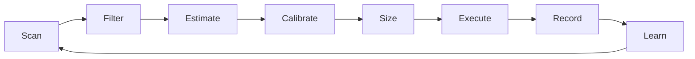

# Elastifund

An autonomous AI agent that runs prediction-market trading experiments, keeps what works, discards what doesn't, and publishes everything.

Inspired by the [autoresearch](https://github.com/karpathy/autoresearch) pattern: give an agent a fixed budget, a clear metric, and let it iterate. Karpathy's agent optimizes val_bpb by modifying a training loop. Ours optimizes risk-adjusted returns by scanning markets, estimating probabilities, and placing trades — then feeding every result back into the next cycle.

Inspired by Andrej Karpathy's brilliant work as always.

> "Give an AI agent a small but real LLM training setup and let it experiment autonomously overnight." — [Andrej Karpathy](https://github.com/karpathy/autoresearch)

Twenty percent of net profits are reserved for veteran suicide prevention.

Canonical LLM handoff docs live at repo root under stable names. Superseded prompt/context variants move to `archive/root-history/` instead of accumulating new versioned filenames at root.

## The Loop



The agent:
1. Scans Polymarket via the Gamma API
2. Filters by liquidity, category, resolution time
3. Estimates event probabilities without seeing the market price (anti-anchoring)
4. Calibrates with Platt scaling fit on resolved data
5. Sizes with Kelly fractions and daily loss caps
6. Executes post-only maker orders
7. Records everything to SQLite and research docs
8. Feeds results into the next research cycle

A parallel research flywheel runs continuously: research, implement, test, record, publish, repeat.

## Results So Far

| Metric | Value |
| --- | --- |
| Strategies tested | 131 (12 families) |
| Strategies deployed | 7 |
| Strategies rejected | 10 (+ 8 pre-rejected) |
| Backtest reference | 68.5% win rate, 0.2171 Brier, 532 resolved markets |
| NO-side win rate | 70.2% |
| Signal sources | 6 (ensemble, VPIN/OFI, lead-lag, sum-violation, combinatorial, debate) |
| Research dispatches | 97 |
| Tests passing | 553 |

Live trading is deployed on a Dublin VPS under `systemd`. The service restarts automatically on validated edges.

## What Makes This Different

Most trading bots optimize a fixed strategy. This system optimizes the strategy-selection process itself:

- **Autonomous keep/discard**: every strategy goes through a kill-rule pipeline. If it doesn't survive cost stress, toxicity, calibration enforcement, and semantic decay filters, it gets rejected. No human override on individual trades.
- **Anti-anchoring**: the LLM never sees the market price when estimating probability. This prevents the single largest source of bias in prediction-market forecasting.
- **Structural alpha scanning**: the agent finds markets where the math is wrong (sum violations, implied-probability gaps) rather than just forecasting better.
- **Full publication**: failures are documented as thoroughly as successes. The [research diary](research/what_doesnt_work_diary_v1.md) of what doesn't work is the most valuable artifact.

## Architecture

```
bot/jj_live.py              — Main autonomous loop
bot/ensemble_estimator.py    — Multi-model probability estimation
bot/ws_trade_stream.py       — WebSocket CLOB feed → VPIN + OFI
bot/lead_lag_engine.py       — Semantic lead-lag arbitrage
bot/kill_rules.py            — Automated strategy rejection
bot/sum_violation_scanner.py — Structural alpha detection
signals/sum_violation/       — Guaranteed-dollar and sum-violation signals
strategies/                  — Strategy implementations
orchestration/               — Capital allocator (risk parity + Thompson sampling)
data_layer/                  — SQLite persistence and CLI
```

## Run Locally

```bash
python3 -m venv .venv
source .venv/bin/activate
pip install --upgrade pip
pip install -r requirements-dev.txt
cp .env.example .env
python3 scripts/elastifund_setup.py --check
python3 scripts/run_root_tests.py
PAPER_TRADING=true python3 bot/jj_live.py --status
```

The safe default is paper mode. Do not put live keys in tracked files.

## Fork-And-Run

To boot the full coordination layer:

```bash
cp .env.example .env
python3 scripts/elastifund_setup.py
docker compose up --build
```

That starts Elasticsearch, Kibana, Kafka, Redis, and a FastAPI hub gateway at `http://localhost:8080`.

## Key Documents

- [docs/ARCHITECTURE.md](docs/ARCHITECTURE.md) — System design
- [docs/PERFORMANCE.md](docs/PERFORMANCE.md) — Metrics and benchmarks
- [docs/RESEARCH_LOG.md](docs/RESEARCH_LOG.md) — Experiment history
- [LLM_CONTEXT_MANIFEST.md](LLM_CONTEXT_MANIFEST.md) — Canonical root context standard
- [KARPATHY_AUTORESEARCH_REPORT.md](KARPATHY_AUTORESEARCH_REPORT.md) — Detailed `autoresearch` comparison and adoption plan
- [research/what_doesnt_work_diary_v1.md](research/what_doesnt_work_diary_v1.md) — Failure diary
- [research/edge_backlog_ranked.md](research/edge_backlog_ranked.md) — Strategy backlog
- [docs/ops/Flywheel_Incentive_System.md](docs/ops/Flywheel_Incentive_System.md) — Community model

## Security

- `.env`, wallet keys, `jj_state.json`, and SQLite databases are gitignored
- Live calibration coefficients are intentionally omitted from public docs
- The architecture is public. The alpha signals are not. Standard practice.
