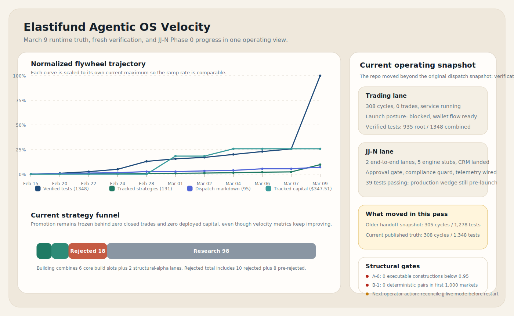
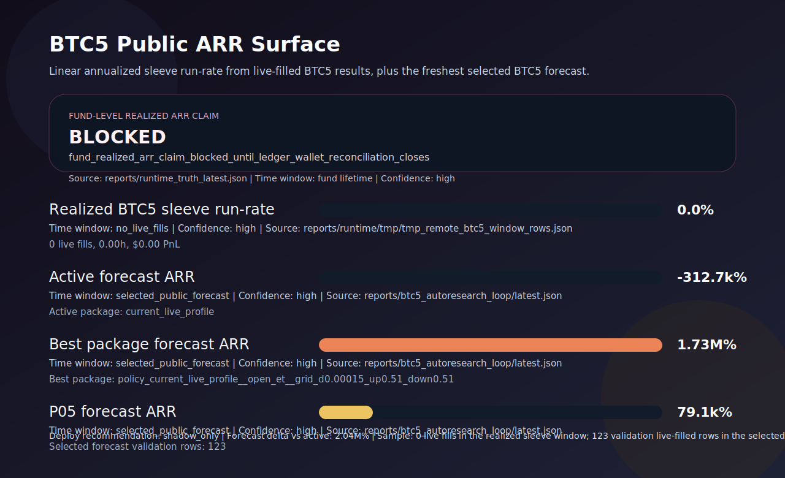

# Elastifund

**A self-improving agentic operating system for real economic work.**

Elastifund is an autonomous trading system where AI agents research, estimate probabilities, size positions, and execute trades on prediction markets — with no human in the loop on individual decisions. The human (John) designs the architecture, safety constraints, and risk parameters. The agent operates within them.

The system is live. It trades real money. It learns from every outcome.

**Website:** [elastifund.io](https://elastifund.io)

---

## Live Performance (March 9, 2026)

| Metric | Value |
|---|---|
| Portfolio value | **$333.18** (Polymarket) + $100 (Kalshi) = **$433** total |
| Available capital | $286.86 |
| Trading status | **Live — placing and resolving real trades** |
| Active categories | Weather, geopolitical, central bank/economic, crypto |
| BTC 5-min maker sleeve | 56 live fills, **+$91.79** cumulative P&L, avg +$1.64/fill |
| Past-day P&L | +$1.91 |
| Strategy catalog | 131 tracked (7 deployed, 6 building, 97 in research pipeline) |
| Test suite | 1,397 passing across all surfaces |
| Commits | 88 |
| Research dispatches | 95 published |

> **Data trust policy:** Portfolio and P&L figures come from the live Polymarket wallet, verified via web UI on March 9, 2026. Local reporting artifacts (`reports/runtime_truth_latest.json`) have historically drifted from wallet truth. When in doubt, wallet wins.

---

## What Has Improved (System Changelog)

This is the autoresearch-style improvement log. Each entry represents a validated change to the live system, not a plan or hypothesis.

### Cycle 2 — Structural Alpha & Microstructure Defense (Current)

**Deployed improvements:**

- **BTC 5-minute maker validated as primary edge.** 56 live fills at +$91.79 cumulative. DOWN direction dominant (41 fills, +$72.40). Average profit per fill: +$1.64. This is the only strategy with statistically meaningful live evidence.
- **Maker-only execution enforced.** 100% post-only orders. Zero taker fees. Maker rebates on every fill. This single change (Dispatch #75) eliminated the fee drag that killed earlier strategies.
- **Six signal sources wired into the live loop.** LLM probability estimation, smart wallet flow detection, LMSR Bayesian pricing, cross-platform arbitrage, VPIN/OFI microstructure, and semantic lead-lag. Each can be independently enabled or disabled per runtime profile.
- **Multi-category trading live.** The system is actively trading weather, geopolitical, central bank, and crypto markets. Category gates control which signal lanes are eligible per market type.
- **Automated kill rules operational.** Semantic decay, toxicity survival, cost stress polynomial, and calibration enforcement — all running in production. Strategies that fail these die automatically.
- **WebSocket CLOB feed integrated.** Real-time order book data flowing into VPIN and OFI calculations for microstructure-aware execution.
- **Calibration locked.** Static Platt A=0.5914, B=-0.3977 validated on 532 markets (Brier 0.2134). Beats all rolling windows tested. No drift detected.

**Known issues being worked:**

- Local accounting ledger drifts from wallet truth (local says 4 open positions; wallet shows 28+). Reconciliation pipeline in progress.
- `FAST_TRADE_EDGE_ANALYSIS.md` pipeline says "REJECT ALL" while the wallet is actively trading. The scan is stale relative to actual execution behavior.
- A-6 (Guaranteed Dollar) and B-1 (Templated Dependency) structural alpha lanes have zero evidence after weeks. Kill decision on March 14.

### Cycle 1 — Foundation & First Trades

- Built the complete six-signal trading loop from scratch
- Deployed to AWS Lightsail Dublin VPS for 24/7 operation
- Integrated Polymarket Gamma API, CLOB, and Kalshi API
- Established the hypothesis testing pipeline with automated kill rules
- Tested and rejected 10 strategies with documented evidence (see `research/what_doesnt_work_diary_v1.md`)
- Published 95 research dispatches covering edge hypotheses, platform analysis, and failure documentation
- Built the non-trading revenue lane (JJ-N) with five-engine architecture, CRM, and compliance gates
- Achieved 1,397 passing tests across all surfaces

---

## Architecture

The system runs two families of workers sharing a common data, evaluation, and improvement layer:

- **Trading workers** — research, simulate, rank, and execute market strategies under policy (Polymarket, Kalshi)
- **Non-trading workers (JJ-N)** — create economic value through business development, research, services, and customer acquisition

The live trading loop:

1. Scan current markets
2. Filter out lanes where the model has no defensible edge
3. Pull recent context and structured inputs
4. Estimate probabilities without anchoring to the market price
5. Calibrate those probabilities (Platt scaling)
6. Compare estimated value to market pricing, fees, and execution constraints
7. Size conservatively (quarter-Kelly)
8. Route only when risk rules and lane-specific gates pass

Around this sits the research flywheel: `research -> implement -> test -> record -> publish -> repeat`

---

## Choose Your Path

| I want to... | Start here |
|---|---|
| Boot the repo with the least friction | [docs/FORK_AND_RUN.md](docs/FORK_AND_RUN.md) |
| Hand one root packet to Deep Research | [COMMAND_NODE.md](COMMAND_NODE.md) |
| Understand the Elastic observability layer | [docs/ELASTIC_INTEGRATION.md](docs/ELASTIC_INTEGRATION.md) |
| Run the observability demo on Replit | [docs/REPLIT_BUILD_GUIDE.md](docs/REPLIT_BUILD_GUIDE.md) |
| Use Codex and Claude Code in parallel | [AGENTS.md](AGENTS.md) + [docs/PARALLEL_AGENT_WORKFLOW.md](docs/PARALLEL_AGENT_WORKFLOW.md) |
| Understand the monorepo layout before editing | [docs/REPO_MAP.md](docs/REPO_MAP.md) |
| Explore the non-trading revenue lane | [nontrading/README.md](nontrading/README.md) + [docs/NON_TRADING_STATUS.md](docs/NON_TRADING_STATUS.md) |
| Work only on the trading bot subproject | [polymarket-bot/README.md](polymarket-bot/README.md) |
| Inspect the HTTP/control-plane surface | [docs/api/README.md](docs/api/README.md) |
| Contribute code safely | [CONTRIBUTING.md](CONTRIBUTING.md) |

## Fastest Local Boot

```bash
git clone https://github.com/CrunchyJohnHaven/elastifund.git
cd elastifund
python3 scripts/doctor.py
python3 scripts/quickstart.py
```

That path prepares `.env`, writes the runtime manifest, and starts the local coordination stack if Docker is installed.

```bash
# Prepare without Docker
python3 scripts/quickstart.py --prepare-only

# Full developer verification
python3 -m venv .venv
source .venv/bin/activate
make bootstrap
make verify
make smoke-nontrading
```

## Verified On March 9, 2026

All commands pass in this repo state: `scripts/doctor.py`, `scripts/quickstart.py --prepare-only`, `make test`, `make test-polymarket`, `make test-nontrading`, `make smoke-nontrading`.

## Velocity Charts

These charts track the BTC5 maker sleeve improvement trajectory. The system continuously evaluates parameter configurations and promotes the best-performing package.





Machine-readable dataset: [improvement_velocity.json](improvement_velocity.json)

## Tech Stack

- Python 3.12, `pytest`, and repo-root `make` targets
- Polymarket Gamma API and CLOB integration
- Kalshi API integration
- SQLite and SQLAlchemy-backed persistence surfaces
- FastAPI-based dashboards and control-plane APIs
- Elastic Stack: Elasticsearch, Kibana, Filebeat, APM Server, and Elastic ML
- Docker Compose for local multi-service boot

## What This Repo Is

Elastifund is a public research engine for three related problems:

1. Where do LLMs actually help on prediction markets?
2. Which bounded non-trading automation lanes can produce cash flow without hand-waved compliance or billing risk?
3. How do you build a self-improving agentic system where better data, better memory, and better evaluation produce measurably better agents?

The repo contains both implementation code and the evidence trail behind it. The failures matter as much as the wins. The unifying principle: the project does not just run agents — it improves agents.

## Observability

Elastic is not a vanity dashboard layer. It is the operator surface for understanding which signal sources produce usable decisions, where latency accumulates in the signal-to-order path, how close the bot is to kill-rule thresholds, what the order book looked like when a trade was placed, and whether order flow or spread behavior has moved into an abnormal regime.

The integration is designed to fail soft. Elasticsearch writes are asynchronous, Filebeat handles shipping, and the bot keeps running with `ES_ENABLED=false` or when the Elastic stack is unreachable.

### Dashboards

- **Trading Overview:** trades per hour, win rate, cumulative P&L, and average fill latency
- **Signal Quality:** per-source signal accuracy, calibration drift, and signal-to-trade conversion
- **Kill Rule Monitor:** kill triggers over time, top firing rules, and current headroom to thresholds
- **Orderbook Health:** spread, depth, VPIN, and OFI state for fast-market execution review

Use [docs/ELASTIC_INTEGRATION.md](docs/ELASTIC_INTEGRATION.md) for the master guide and [docs/REPLIT_BUILD_GUIDE.md](docs/REPLIT_BUILD_GUIDE.md) for the Replit path.

## Non-Trading Lane (JJ-N)

The non-trading revenue worker (JJ-N) is the first-class front door of the project. The vision: start with a constrained revenue-operations worker for one narrow, high-ticket service offer, instrument everything, publish the evidence, and only expand once the first loop is repeatable.

JJ-N v1 is a revenue-operations worker with five engines: Account Intelligence, Outreach, Interaction, Proposal, and Learning. All five write into the same Elastic-backed memory.

What is already real: a compliance-first revenue-agent harness, a runnable five-engine `RevenuePipeline`, the first service offer (Website Growth Audit, $500-$2500), a digital-product niche discovery pipeline, a Phase 0 CRM, paper-mode approval and compliance gates, Elastic-ready telemetry, niche ranking, and passing targeted tests with deterministic smoke coverage.

What is not built yet: the fully launched production path for the Website Growth Audit plus recurring monitor, a production KPI dashboard, and checkout/billing/fulfillment reporting.

For the current implementation state, use [docs/NON_TRADING_STATUS.md](docs/NON_TRADING_STATUS.md).

## Repo Tour

| Path | Purpose |
|---|---|
| `bot/` | live trading loop, signal wiring, structural-arb scanners, runtime decisions |
| `execution/` | multi-leg order orchestration and rollback rules |
| `strategies/` + `signals/` | strategy-specific logic and shared signal helpers |
| `src/`, `backtest/`, `simulator/` | edge-discovery and validation pipeline |
| `hub/`, `data_layer/`, `orchestration/` | APIs, persistence, flywheel/control-plane plumbing |
| `nontrading/` | non-trading revenue automation, Phase 0 CRM/approval/telemetry foundations, and digital-product discovery |
| `polymarket-bot/` | self-contained trading bot subproject with dashboard and tests |
| `inventory/` | benchmark lane for comparing external systems cleanly |
| `docs/` + `research/` | durable docs, ADRs, prompts, dispatches, and findings |
| `deploy/` | bootstrap scripts and deployment assets |

If you want the deeper map, use [docs/REPO_MAP.md](docs/REPO_MAP.md).

## Key Documents

| Document | Purpose |
|---|---|
| [docs/FORK_AND_RUN.md](docs/FORK_AND_RUN.md) | easiest bootstrap and host/spoke onboarding flow |
| [AGENTS.md](AGENTS.md) | machine-first entrypoint and core commands |
| [COMMAND_NODE.md](COMMAND_NODE.md) | single root deep-research handoff for current machine truth, implementation map, and improvement guidance |
| [docs/ELASTIC_INTEGRATION.md](docs/ELASTIC_INTEGRATION.md) | master Elastic Stack integration guide |
| [docs/REPLIT_BUILD_GUIDE.md](docs/REPLIT_BUILD_GUIDE.md) | Replit deployment path for the observability stack |
| [docs/ELASTIC_LESSONS_LEARNED.md](docs/ELASTIC_LESSONS_LEARNED.md) | public log of what the Elastic layer actually teaches us |
| [docs/PARALLEL_AGENT_WORKFLOW.md](docs/PARALLEL_AGENT_WORKFLOW.md) | how to split work between Codex and Claude Code safely |
| [docs/REPO_MAP.md](docs/REPO_MAP.md) | canonical monorepo map and edit boundaries |
| [nontrading/README.md](nontrading/README.md) | non-trading developer entrypoint |
| [docs/NON_TRADING_STATUS.md](docs/NON_TRADING_STATUS.md) | current implementation status of the non-trading lane |
| [polymarket-bot/README.md](polymarket-bot/README.md) | standalone trading bot subproject guide |
| [docs/api/README.md](docs/api/README.md) | API surfaces and OpenAPI generation |
| [research/dispatches/README.md](research/dispatches/README.md) | dispatch system for parallel research and implementation |
| [research/what_doesnt_work_diary_v1.md](research/what_doesnt_work_diary_v1.md) | failure diary and dead-lane evidence |

## Mission

**20% of all net trading profits go to veteran suicide prevention.**

- [Veterans Crisis Line](https://www.veteranscrisisline.net/)
- [Stop Soldier Suicide](https://stopsoldiersuicide.org/)
- [22Until None](https://www.22untilnone.org/)

## Contributing

The repo is open because scrutiny is useful. If you contribute: be explicit about whether something is live, paper, backtest, non-trading research, or ops. Bring tests or evidence when behavior changes. Do not leak secrets, wallets, or private operational settings. Prefer a clean failure over a vague success claim.

Start with [CONTRIBUTING.md](CONTRIBUTING.md).

## Security

See [SECURITY.md](SECURITY.md) for vulnerability reporting and disclosure expectations.

## License

MIT.
