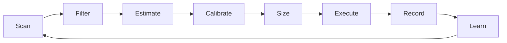

# Elastifund

An autonomous AI agent and public monorepo for running prediction-market trading research, execution experiments, and coordination tooling.

Inspired by [Karpathy's `autoresearch`](https://github.com/karpathy/autoresearch): fixed loop, explicit metric, real experiments, and ruthless keep-or-kill discipline. Elastifund applies that mindset to forecasting, execution quality, and open research publication.

**Website:** [elastifund.io](https://elastifund.io)

Twenty percent of net profits are reserved for veteran suicide prevention.

## Choose Your Path

| I want to... | Start here |
|---|---|
| Boot the repo with the least friction | [docs/FORK_AND_RUN.md](docs/FORK_AND_RUN.md) |
| Use Codex and Claude Code in parallel | [AGENTS.md](AGENTS.md) + [docs/PARALLEL_AGENT_WORKFLOW.md](docs/PARALLEL_AGENT_WORKFLOW.md) |
| Understand the monorepo layout before editing | [docs/REPO_MAP.md](docs/REPO_MAP.md) |
| Inspect the current operating context | [PROJECT_INSTRUCTIONS.md](PROJECT_INSTRUCTIONS.md) |
| Work only on the trading bot subproject | [polymarket-bot/README.md](polymarket-bot/README.md) |
| Inspect the HTTP/control-plane surface | [docs/api/README.md](docs/api/README.md) |
| Contribute code safely | [CONTRIBUTING.md](CONTRIBUTING.md) |

## Fastest Local Boot

From the repo root:

```bash
git clone https://github.com/CrunchyJohnHaven/elastifund.git
cd elastifund
python3 scripts/doctor.py
python3 scripts/quickstart.py
```

That path is designed for first-time users. It prepares `.env`, writes the runtime manifest, and starts the full local coordination stack if Docker is installed.

If you want to prepare the repo without starting Docker yet:

```bash
python3 scripts/quickstart.py --prepare-only
```

If you want the full developer verification pass as well:

```bash
python3 -m venv .venv
source .venv/bin/activate
make bootstrap
make verify
```

## Verified On March 8, 2026

These commands were run successfully in this repo state:

- `python3 scripts/doctor.py`
- `python3 scripts/quickstart.py --prepare-only`
- `make hygiene`
- `make test`
- `make test-polymarket`

The non-Docker path was verified directly. Docker still requires Docker Desktop or Docker Engine on the machine running the stack.

## What This Repo Is

Elastifund is a public research engine for prediction-market trading. It tries to answer three questions honestly:

1. Where do LLMs actually help on prediction markets?
2. Which strategies survive realistic costs, sparse signals, and execution constraints?
3. How do you run a multi-agent trading and research stack without hiding the failures?

That means the repo contains both implementation code and the evidence trail behind it. The failures matter as much as the wins.

## The Loop



Core loop:

1. Scan markets.
2. Filter out lanes with no defensible edge.
3. Estimate probabilities without market-price anchoring.
4. Calibrate probabilities on resolved evidence.
5. Compare edge versus fees, spread, and execution risk.
6. Size conservatively.
7. Record what happened.
8. Feed the result back into the next cycle.

## Current Snapshot

| Area | Current state |
|---|---|
| Capital tracked in docs | `$347.51` total (`$247.51` Polymarket + `$100` Kalshi) |
| Strategy catalog | `131` tracked (`7` deployed, `8` building, `10` rejected, `8` pre-rejected, `98` pipeline) |
| Verified tests | repo-root regression suite plus the standalone `polymarket-bot` suite |
| `bot/` Python modules | `38` |
| Research dispatches | `95` markdown dispatch files |
| Active signal lanes | forecasting, flow/microstructure, structural arb, validation lanes |
| Live validated P&L | still effectively pre-revenue; no inflated claims here |

## Why This Is Different

- **Autonomous keep-or-kill discipline.** Strategies survive only if they clear real validation gates.
- **Anti-anchoring.** The model estimates probability without seeing the market price first.
- **Execution realism.** Fees, spread, routing, and dwell time matter as much as forecasting.
- **Open failure diary.** Dead lanes are documented instead of hidden.
- **Shared control plane.** Forks can join one hub instead of pretending every clone is an island.

## Repo Tour

| Path | Purpose |
|---|---|
| `bot/` | live trading loop, structural-arb scanners, runtime decisions |
| `signals/` + `strategies/` | signal helpers and strategy-specific logic |
| `src/`, `backtest/`, `simulator/` | edge discovery, benchmarking, and validation |
| `hub/`, `data_layer/`, `orchestration/` | API, persistence, and coordination layer |
| `polymarket-bot/` | standalone trading-bot subproject |
| `docs/` + `research/` | durable docs, ADRs, prompts, dispatches, and findings |
| `deploy/` | Docker, bootstrap, and operator-facing assets |

If you want the deeper map, use [docs/REPO_MAP.md](docs/REPO_MAP.md).

## Key Documents

| Document | Purpose |
|---|---|
| [docs/FORK_AND_RUN.md](docs/FORK_AND_RUN.md) | easiest bootstrap and host/spoke onboarding flow |
| [AGENTS.md](AGENTS.md) | machine-first entrypoint and core commands |
| [docs/PARALLEL_AGENT_WORKFLOW.md](docs/PARALLEL_AGENT_WORKFLOW.md) | safe Codex/Claude split patterns |
| [docs/REPO_MAP.md](docs/REPO_MAP.md) | canonical monorepo map and edit boundaries |
| [PROJECT_INSTRUCTIONS.md](PROJECT_INSTRUCTIONS.md) | current operating context and priority queue |
| [COMMAND_NODE.md](COMMAND_NODE.md) | deeper root-level context for broader AI sessions |
| [LLM_CONTEXT_MANIFEST.md](LLM_CONTEXT_MANIFEST.md) | canonical root package and naming standard |
| [SECURITY.md](SECURITY.md) | vulnerability reporting and disclosure expectations |
| [SUPPORT.md](SUPPORT.md) | where to start when setup or runtime behavior looks wrong |
| [docs/api/README.md](docs/api/README.md) | API surfaces and OpenAPI generation |
| [research/what_doesnt_work_diary_v1.md](research/what_doesnt_work_diary_v1.md) | failure diary and dead-lane evidence |

## Security

- `.env`, wallet keys, `jj_state.json`, and SQLite databases are gitignored
- Live calibration coefficients and private operational details stay out of the public repo
- The architecture is public; live secrets and active edge parameters are not

## Mission

**20% of all net trading profits go to veteran suicide prevention.**

- [Veterans Crisis Line](https://www.veteranscrisisline.net/)
- [Stop Soldier Suicide](https://stopsoldiersuicide.org/)
- [22Until None](https://www.22untilnone.org/)

## Contributing

The repo is open because scrutiny is useful. If you contribute:

- be explicit about whether something is live, paper, backtest, or research
- bring tests or evidence when behavior changes
- do not leak secrets, wallets, or private operational settings
- prefer a clean failure over a vague success claim

Start with [CONTRIBUTING.md](CONTRIBUTING.md).

## License

MIT.
