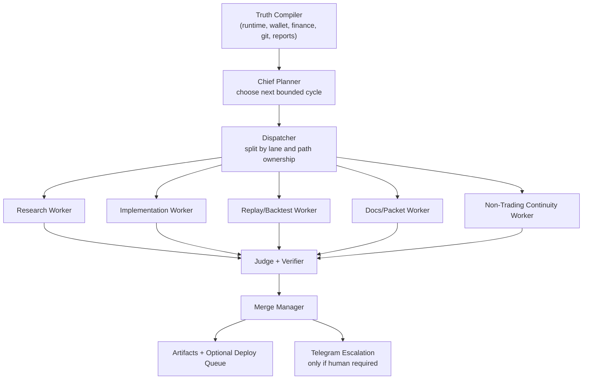

# Autoprompting System

| Metadata | Value |
|---|---|
| File | `autoprompting.md` |
| Role | Root build packet for autonomous planning, dispatch, verification, merge, and escalation |
| Status | Requested root operator packet |
| Last updated | 2026-03-12 |
| Primary near-term objective | Reverse-engineer the best 5-15 minute Polymarket traders and build a system that can methodically reproduce and improve their edge |
| Human escalation channel | Telegram via `TELEGRAM_BOT_TOKEN` and `TELEGRAM_CHAT_ID` |

## Why This File Exists

Right now too much of the improvement loop lives in your head:

- You ask GPT-5.4 Extra High for a plan.
- You translate that plan into multiple agent tasks.
- You dispatch sessions manually.
- You wait for outputs.
- You merge, restate context, and repeat.

That is useful in the short term, but it does not compound well. The real product is not only the trading agent. The real product is the self-improving system that can keep finding, validating, implementing, and operationalizing edge while you stay focused on the highest-leverage decisions.

This file defines the system we should build so the repo can:

1. Read current machine truth on its own.
2. Decide what the next bounded improvement cycle should be.
3. Generate a concrete multi-instance plan automatically.
4. Dispatch work across isolated lanes with explicit path ownership.
5. Judge outputs using tests, artifact checks, and second-model review.
6. Merge safe work automatically.
7. Hold back unsafe work automatically.
8. Deploy only within policy.
9. Keep non-trading progress alive in parallel with trading.
10. Notify you on Telegram only when a real human decision is required.

The immediate proving ground for this system is fast Polymarket trading, especially the behavior of the strongest 5-15 minute traders. If we can build an autonomous research-and-implementation loop around that lane, we can generalize the same control plane to JJ-N, finance, and every later economic lane.

## Outcome We Want

We want an Elastifund control plane that behaves like a chief of staff, research director, engineering manager, reviewer, and release coordinator combined:

- always reading the latest truth
- always selecting the highest-value next cycle
- always dispatching the right number of workers
- always preserving path ownership
- always emitting machine-readable artifacts
- always keeping a bounded budget
- always escalating only when needed

If this system works, your role changes from "manual prompt router" to "capital allocator, strategy chooser, and final authority for edge cases."

## What This System Must Optimize

Primary optimization target:

`expected_validated_edge_gain_30d + expected_information_gain_30d + expected_nontrading_velocity_gain_30d`

Subject to:

- live-risk policy
- finance autonomy caps
- branch and path ownership rules
- benchmark integrity
- test and artifact contracts
- time and model budgets

Near-term success is not "the agents were busy." Near-term success is:

- more validated understanding of elite Polymarket fast traders
- faster conversion of research into replayed and shadow-tested code
- fewer manual prompting loops from you
- continued non-trading progress despite your attention staying on trading

## Hard Constraints

These are non-negotiable:

1. `reports/runtime_truth_latest.json`, `reports/remote_cycle_status.json`, `reports/remote_service_status.json`, wallet/export truth, and finance artifacts outrank stale prose.
2. One owner per path at a time. If two workers need the same file, the dispatcher must re-split the cycle.
3. Live execution is isolated from research mutation. Research may recommend; execution promotes only through policy.
4. OpenClaw stays `comparison_only` as already specified in `inventory/systems/openclaw/README.md`.
5. Telegram should be low-noise. By default the system stays silent unless you must act.
6. No silent widening of risk, treasury autonomy, or monthly spend caps.
7. No repo-wide self-modification without lane boundaries.
8. Every autonomous cycle must end with explicit artifacts, not vague summaries.

## Truth Precedence

When facts conflict, the autoprompting system should use this order:

1. Live wallet data and attached wallet exports for capital, realized cash flow, and actual positions.
2. `reports/runtime_truth_latest.json` and `reports/public_runtime_snapshot.json` for posture, mode, runtime profile, and reconciliation state.
3. `reports/remote_cycle_status.json` and `reports/remote_service_status.json` for current service and launch truth.
4. `reports/finance/latest.json`, `reports/finance/allocation_plan.json`, and `reports/finance/action_queue.json` for budget and finance gating.
5. `reports/root_test_status.json` plus fresh test output for verification truth.
6. `research/edge_backlog_ranked.md` and current cycle artifacts for research priority truth.
7. Human-written docs after the above have been read and compared.

## Existing Repo Pieces This Should Reuse

This system should not start from zero. It should sit on top of what already exists:

| Existing surface | Why it matters |
|---|---|
| `docs/ops/Flywheel_Control_Plane.md` | Promotion ladder, automation outputs, safety boundary |
| `scripts/btc5_dual_autoresearch_ops.py` | Existing long-running autoresearch supervision pattern |
| `reports/btc5_autoresearch/latest.json` | Example of machine-readable candidate and policy outputs |
| `docs/ops/CODEX_PLANNING_PROMPT.md` | Current multi-instance planning template |
| `research/karpathy_autoresearch_report.md` | Lane-bounded autoresearch pattern and keep/discard framing |
| `polymarket-bot/src/telegram.py` | Existing Telegram notifier implementation |
| `inventory/systems/openclaw/README.md` | Existing benchmark-only OpenClaw isolation model |
| `AGENTS.md` and `docs/PARALLEL_AGENT_WORKFLOW.md` | Path ownership and parallel workflow rules |

The right move is to turn these scattered pieces into one explicit control plane, not to replace them all with a new framework.

## Architecture

### Recommended High-Level Shape

Use the existing AWS Lightsail infrastructure as phase 1, then split if load or isolation demands it.

- `autoprompt-control`: one long-running orchestration service that reads repo truth, plans cycles, dispatches workers, judges outputs, and pages you when blocked
- `worker sessions`: isolated Codex, Claude, GPT, or Hermes-like agent runs with explicit lane ownership
- `comparison bench`: optional OpenClaw isolated benchmark stack, never allowed to touch live allocator or shared state
- `github merge lane`: a controlled merge manager that only lands work after deterministic checks and policy checks pass
- `telegram notifier`: a low-noise action-required pager

### Control Plane Layers

| Layer | Purpose | Notes |
|---|---|---|
| Truth compiler | Build one cycle packet from machine truth, git state, artifacts, and active priorities | Must run before planning |
| Chief planner | Choose the next bounded objective and split into lanes | Large-context reasoning model |
| Dispatcher | Create worker packets with exact path ownership and budgets | No overlapping file ownership |
| Worker supervisors | Run implementation, research, docs, and benchmark workers | Timeboxed and artifact-driven |
| Judge and verifier | Run tests, metric comparison, and second-model review | Deterministic checks outrank prose |
| Merge manager | Auto-merge safe diffs, hold risky diffs, request human approval when needed | Branch-aware and policy-aware |
| Publisher and notifier | Update artifacts, summaries, Telegram, and deployment queues | Silent by default unless action needed |

### System Diagram



## Recommended Agent Stack

The stack should be role-based, not brand-based.

| Role | Preferred use | Notes |
|---|---|---|
| Chief planner | GPT-5.4 Extra High or the strongest available long-context planner | Best for plan synthesis and decomposition |
| Deep critic / cross-checker | Claude Max or equivalent long-context second opinion | Good for catching plan blind spots and doc inconsistencies |
| Focused implementer | Codex or equivalent tool-using coding worker | Best for narrow code patches, test repair, and scripts |
| Fast reviewer | Mid-cost model with deterministic checks | Used after tests and artifact diffs already run |
| Benchmark comparator | OpenClaw in isolated `comparison_only` mode | Never merge authority, never wallet authority |

### OpenClaw and Hermes Positioning

OpenClaw should remain a comparison lane, not the system governor. The repo already treats it that way. That is correct.

Hermes-style or other long-running agent supervisors are useful only if they help with:

- persistent sessions
- retries
- heartbeats
- bounded tool permissions
- budget tracking
- artifact persistence

They should not own:

- truth precedence
- live-risk policy
- merge policy
- treasury policy

Those belong to the Elastifund control plane.

## Operating Modes

The autoprompting system should support these modes:

| Mode | What it can do | Typical use |
|---|---|---|
| `observe_only` | Read truth, plan, recommend, no code writes | Dry run and trust-building |
| `research_auto` | Generate research packets, run analysis, write artifacts and docs | Fast-trader deconstruction, literature synthesis |
| `safe_build_auto` | Patch docs, scripts, non-live-sensitive code, run narrow tests, auto-merge if green | High-velocity iteration |
| `gated_build_auto` | Patch live-sensitive paths but require stronger verification and policy approval logic | `bot/`, `execution/`, `strategies/`, `signals/` |
| `deploy_recommend` | Prepare deploy packets and restart recommendations | Default for live-adjacent work |
| `deploy_within_policy` | Deploy only where policy explicitly allows automated promotion | Later phase only |

Default for phase 1 should be `research_auto + safe_build_auto + deploy_recommend`.

## Autonomy Tiers

The merge manager should classify every proposed change into one of these tiers:

| Tier | Allowed automation | Human involvement |
|---|---|---|
| 0 | Read, summarize, rank, and publish internal artifacts only | None |
| 1 | Auto-merge docs, research, reports, prompts, diagrams, and bounded scripts if checks pass | None |
| 2 | Auto-merge non-live-sensitive code if tests pass and no policy boundary is touched | None |
| 3 | Prepare PR or gated merge for live-sensitive code with evidence and judge approval | Human optional depending on risk class |
| 4 | Live capital, finance-policy, credential, or architecture-change decisions | Human required |

`bot/`, `execution/`, `strategies/`, `signals/`, and `nontrading/finance/` should start at Tier 3.

## The Core Cycle

Every cycle should follow the same shape.

### 1. Compile Truth

Read:

- `COMMAND_NODE.md`
- `PROJECT_INSTRUCTIONS.md`
- `AGENTS.md`
- `docs/REPO_MAP.md`
- `research/edge_backlog_ranked.md`
- `reports/runtime_truth_latest.json`
- `reports/remote_cycle_status.json`
- `reports/remote_service_status.json`
- `reports/root_test_status.json`
- `reports/finance/latest.json`
- `reports/finance/allocation_plan.json`
- current git status and branch state

Write:

- `reports/autoprompting/latest.json`
- `reports/autoprompting/cycles/<timestamp>.json`

### 2. Select A Bounded Objective

The planner must choose a single cycle objective, not a pile of wishes.

Examples:

- "Mine and classify elite 5-15 minute wallet behavior"
- "Convert replay evidence into a wallet-flow clone prototype"
- "Repair launch-contract truth so current edge can be judged correctly"
- "Keep JJ-N moving by pushing the Website Growth Audit delivery lane one notch forward"

### 3. Generate Lane Programs

The planner should emit a program packet for each lane with:

- objective
- in-scope files
- out-of-scope files
- evaluator
- keep/discard/crash rule
- artifact path
- test command
- maximum budget
- maximum wall-clock duration

### 4. Dispatch Workers

Each worker gets:

- exact path ownership
- one bounded objective
- one verification command
- one artifact contract
- a stop rule if blocked

### 5. Collect Artifacts

The dispatcher waits for:

- changed files
- tests
- reports
- diff summary
- machine-readable outcome class: `keep`, `discard`, `crash`, `blocked`

### 6. Judge

The judge must answer:

- Did the worker stay in scope?
- Did the tests pass?
- Did the artifact contract land?
- Did this improve the target metric or information frontier?
- Is the diff safe to merge automatically?

### 7. Merge Or Hold

Allowed outcomes:

- `auto_merge`
- `merge_after_rebase`
- `hold_for_human`
- `discard_but_keep_artifact`
- `retry_with_narrower_scope`

### 8. Publish And Page If Needed

Always update internal artifacts.

Only page you if:

- a human decision is required
- a credential or external account is needed
- spending or risk policy must change
- two valid paths exist with no dominant winner
- the system hit repeated blocked retries

## The Immediate Research Program: Elite 5-15 Minute Polymarket Traders

This is the first high-value autonomous research target because it is concrete, economically relevant, and tightly connected to the repo's strongest current lane.

### Program Goal

Build a repeatable system that can answer:

1. Who are the best 5-15 minute Polymarket traders?
2. What are they actually doing?
3. Which parts of that behavior are signal, execution edge, or structural privilege?
4. Which parts are reproducible by Elastifund?
5. Which parts are not worth copying?

### Questions The System Must Answer

The system should not stop at "find profitable wallets." It should deconstruct behavior.

It must classify:

- opening behavior
- time-to-first-trade after market open
- buy-vs-sell bias
- YES/NO bias
- maker-vs-taker tendency
- order-size laddering
- inventory hold time
- average position concentration
- asset preference by BTC, ETH, SOL, XRP, threshold, range, and candle family
- session preference by ET hour
- price-bucket preference
- early consensus behavior across top wallets
- latency relative to external spot moves
- whether PnL comes from directional forecasting, queue position, structure, or exit discipline

### Core Hypothesis Families

The initial research stack should track these families:

| Family | Hypothesis |
|---|---|
| Wallet consensus | Top wallets converging early on one side predict short-horizon outcome |
| Opening burst | The first 30-120 seconds after market open contain exploitable informed flow |
| External price lag | Centralized exchange spot moves lead Polymarket short-duration repricing |
| Queue discipline | Elite traders make money by posting at specific levels, not by directional brilliance alone |
| Session specialization | Some wallets only shine in certain ET hours or assets |
| Inventory management | Profitability may come from superior exit timing and partial inventory unwinds |
| Structural lane selection | Threshold or range contracts may be better than candles for certain players |
| Copyability gap | Some wallets are not copyable because their edge is speed, internal inventory, or privileged infrastructure |

### Data Sources

The research system should build on:

- Polymarket public trades endpoint
- Gamma active events and markets
- CLOB order book and WebSocket data
- internal runtime truth and wallet reconciliation artifacts
- existing BTC5 autoresearch outputs
- replay databases and historical export summaries
- optional off-repo wallet exports when attached locally and not committed

### Required Derived Datasets

The autoprompting system should plan for these future datasets:

- `reports/autoprompting/wallet_universe/latest.json`
- `reports/autoprompting/wallet_rankings/latest.json`
- `reports/autoprompting/trader_taxonomy/latest.json`
- `reports/autoprompting/clone_candidates/latest.json`
- `reports/autoprompting/replay_frontier/latest.json`
- `reports/autoprompting/human_queue/latest.json`

### Research Workstreams

The chief planner should split the fast-trader program into these repeatable lanes:

| Lane | Goal | Typical ownership |
|---|---|---|
| Wallet discovery | Build the candidate universe of wallets worth tracking | `research/`, `scripts/`, `reports/` |
| Wallet ranking | Rank wallets by realized and replay-adjusted quality | `src/`, `data_layer/`, `reports/` |
| Behavior taxonomy | Label trader types and session specialties | `research/`, `signals/`, `reports/` |
| Clone design | Turn behavior patterns into candidate rule sets | `strategies/`, `signals/`, `research/` |
| Replay harness | Evaluate clone strategies on frozen windows | `backtest/`, `simulator/`, `reports/` |
| Shadow integration | Wire viable clones into shadow-safe execution paths | `bot/`, `execution/`, `strategies/` |
| Operator packet sync | Keep docs and truth surfaces aligned with findings | `docs/`, `COMMAND_NODE.md`, `research/` |
| Non-trading continuity | Ensure JJ-N keeps moving while trading gets attention | `nontrading/`, `docs/ops/`, `reports/finance/` |

### What Counts As A Real Win

A real win is not just "the wallets look interesting."

A real win means one of the following happened:

- a new behavioral cluster was discovered and survived replay
- a clone strategy improved the benchmark frontier
- a previously vague idea was killed with evidence
- a shadow-safe implementation path was shipped
- the system proved a top-wallet behavior is not copyable and saved time

## Karpathy-Style Lane Programs

The repo already correctly notes that whole-repo autoresearch is too broad. The fix is to create narrow programs.

Each important lane should get its own `program` document with:

- one mutable surface
- one immutable evaluator
- one scalar objective
- one fixed time or budget envelope
- one append-only result ledger
- one keep/discard/crash decision

Suggested first program files:

- `research/programs/pm_fast_wallet_universe.md`
- `research/programs/pm_fast_trader_taxonomy.md`
- `research/programs/pm_fast_clone_replay.md`
- `research/programs/pm_fast_shadow_integration.md`
- `research/programs/nontrading_continuity.md`

This is how the system becomes methodical instead of generating fresh prose every cycle.

## Path Ownership Rules For Automatic Dispatch

The dispatcher must inherit repo rules directly.

| Worker type | Best-fit paths |
|---|---|
| Focused implementer | `bot/`, `execution/`, `strategies/`, `signals/`, `nontrading/` |
| Research synthesizer | `research/`, `docs/`, `docs/ops/`, `deploy/` |
| Replay and evaluator | `src/`, `backtest/`, `simulator/`, `reports/` |
| Finance-aware allocator | `nontrading/finance/`, `reports/finance/`, `docs/ops/finance_control_plane.md` |

Rules:

1. One worker owns one path family at a time.
2. A worker packet must say which files it may not touch.
3. If two lanes converge on one file, the planner must merge the lanes conceptually before dispatch, not after conflict.
4. Docs and code should be split when possible.

## Git Strategy

The git layer should be explicit, boring, and safe.

### Branch Naming

Use branch prefixes that fit repo rules:

- `codex/auto/<cycle-id>-<lane>`
- `codex/review/<cycle-id>`

### Merge Policy

Auto-merge is allowed only if all are true:

1. The lane stayed within owned paths.
2. Required tests passed.
3. Required artifacts were written.
4. No policy boundary was crossed.
5. The judge marked the change `keep`.
6. The merge manager sees no overlapping pending work on the same files.

### Merge Outcomes

| Outcome | Meaning |
|---|---|
| `merge_now` | Safe to land on the default branch immediately |
| `merge_after_queue` | Safe, but wait for earlier compatible lane to land first |
| `open_pr_and_hold` | Good work, but needs human review or timing discretion |
| `discard` | Keep the research artifact, do not land the code |
| `archive` | Keep summary only, abandon the lane |

### Deploy Policy

The control plane may:

- update docs
- update reports
- update research programs
- patch bounded scripts
- prepare deployment packets

The control plane should not automatically restart or promote live trading just because code merged. Deployment remains a separate policy decision until the system has earned more trust.

## Telegram Escalation Contract

Telegram is for action, not chatter.

### Default Notification Policy

Send no Telegram message unless one of the escalation rules fired.

Optional future setting:

- one end-of-day summary only if the user opts in

### Escalation Reasons

| Reason code | When to page |
|---|---|
| `finance_policy_required` | Spend would exceed active caps or a new recurring commitment is proposed |
| `risk_policy_required` | A risk limit, reserve floor, or live-capital envelope must change |
| `credential_required` | A login, API key, 2FA step, or manual external auth is needed |
| `architecture_tie` | Two materially different approaches are both viable and the system cannot rank one clearly higher |
| `merge_conflict_on_live_path` | Competing diffs touch the same live-sensitive files |
| `repeated_blocker` | The same lane failed or blocked repeatedly and needs intervention |
| `deploy_decision_required` | Work is ready but promotion to live or micro-live should be a human choice |
| `external_human_task` | The system needs you to contact someone, upload something, or approve a vendor/tool |

### Telegram Message Template

```text
ELASTIFUND AUTOPROMPTING: HUMAN ACTION REQUIRED

Reason: <reason_code>
Cycle: <cycle_id>
Severity: <low|medium|high>
Blocked lane: <lane_name>
What changed: <2-4 sentence summary>
Why the system cannot continue alone: <single sentence>
Recommended action: <single sentence>
If ignored for 24h: <impact statement>
Artifacts: <paths or links>
```

### Telegram Delivery Implementation

Reuse `polymarket-bot/src/telegram.py` rather than inventing a second notifier. The control plane should wrap that client and standardize:

- severity
- deduplication window
- message type
- cycle id
- artifact links or paths

## Budget Policy

Treat model spend as controlled capital allocation, not as taboo overhead.

You explicitly want the option to spend closer to `$800/month` if it increases forward velocity. The system should support that.

### Initial LLM Budget Envelope

| Bucket | Monthly target |
|---|---|
| Chief planning and synthesis | `$200` |
| Deep research and comparison passes | `$150` |
| Implementation workers | `$250` |
| Judge and review passes | `$100` |
| Reserve for bursts and hard cycles | `$100` |
| Total | `$800` |

### Budget Rules

1. Expensive models are for planning, ambiguity resolution, and final judgment.
2. Mid-cost models are for implementation and refactors.
3. Cheap models are for rote transforms, formatting, and low-stakes summarization.
4. The chief planner should spend more only when the cycle value justifies it.
5. If a lane repeatedly fails to improve the frontier, the planner should shrink or pause its budget automatically.

## Standing Non-Trading Continuity Lane

Because your attention is correctly concentrated on trading, the control plane should reserve one smaller standing lane for non-trading continuity.

That lane's job is not to distract from trading. Its job is to prevent total atrophy in:

- Website Growth Audit execution
- pipeline readiness
- delivery materials
- outbound readiness blockers
- evidence packaging
- tool and budget allocation proposals

The planner should keep this lane bounded and low-noise, but it should always exist unless a higher-priority incident is active.

## Proposed Files And Services To Build

This file is a design packet, not the implementation itself. The likely buildout should add:

### New code surfaces

- `orchestration/autoprompting/context_builder.py`
- `orchestration/autoprompting/planner.py`
- `orchestration/autoprompting/dispatcher.py`
- `orchestration/autoprompting/judge.py`
- `orchestration/autoprompting/merge_manager.py`
- `orchestration/autoprompting/human_queue.py`
- `orchestration/autoprompting/telegram_router.py`
- `scripts/run_autoprompt_cycle.py`
- `scripts/run_fast_trader_research_cycle.py`

### New artifacts

- `reports/autoprompting/latest.json`
- `reports/autoprompting/cycles/<timestamp>.json`
- `reports/autoprompting/tasks/<cycle-id>.json`
- `reports/autoprompting/merges/<cycle-id>.json`
- `reports/autoprompting/human_queue/latest.json`
- `reports/autoprompting/wallet_universe/latest.json`
- `reports/autoprompting/trader_taxonomy/latest.json`

### New services

- `deploy/autoprompt-control.service`
- `deploy/autoprompt-control.timer`
- `deploy/fast-trader-research.service`
- `deploy/fast-trader-research.timer`

### Optional state store

- `state/autoprompting.db`

SQLite is enough for phase 1. We do not need a heavyweight scheduler before proving the control logic.

## Implementation Roadmap

### Phase 0: Make The System Legible

Goal:

- define the architecture
- define the artifacts
- define the escalation contract

Deliverables:

- this file
- initial program specs under `research/programs/`
- decision on where the control plane code should live

### Phase 1: Context Compiler And Planner

Goal:

- automate context assembly
- automatically pick the next bounded cycle
- automatically emit non-overlapping worker packets

Success condition:

- you can trigger one command and get a six-lane plan without writing a fresh manual prompt

### Phase 2: Research Auto-Dispatch

Goal:

- run wallet discovery, ranking, taxonomy, and replay lanes automatically
- write machine-readable outputs
- keep research ledgers and keep/discard decisions

Success condition:

- the system can run multiple fast-trader research cycles per day with no human prompting

### Phase 3: Safe Build Auto-Merge

Goal:

- convert approved research into bounded code patches
- run tests
- auto-merge safe diffs

Success condition:

- docs, research, reports, and some bounded code changes land automatically without your intervention

### Phase 4: Gated Live-Adjacent Execution

Goal:

- support live-sensitive path changes with stronger judging
- prepare deployment recommendations and optionally deploy within explicit policy

Success condition:

- the system can carry a hypothesis from discovery to shadow implementation to deployment recommendation

### Phase 5: Full Self-Improvement Loop

Goal:

- always-on cycle selection
- standing research, implementation, docs, and non-trading continuity lanes
- Telegram only for real human gates

Success condition:

- the system improves itself faster than manual prompting would, without creating merge archaeology or silent live-risk drift

## Master Orchestrator Prompt

This is the heart of the system. It should be stored later as a formal prompt artifact, but it belongs here now.

```text
You are the Elastifund Autoprompt Orchestrator.

Your job is not to brainstorm indefinitely. Your job is to run a bounded self-improvement cycle for Elastifund.

You must:
1. Read current machine truth before making claims.
2. Choose one bounded cycle objective with the highest expected validated edge gain or information gain.
3. Split work into non-overlapping lanes with explicit path ownership.
4. Give each lane one objective, one verification command, one artifact contract, and one stop rule.
5. Prefer methodical benchmark progress over vague ambitious rewrites.
6. Keep live execution and finance policy boundaries intact.
7. Keep one standing continuity lane for non-trading progress unless a higher-priority incident is active.
8. Auto-merge only safe, verified work.
9. Escalate to the human on Telegram only when a real decision or external action is required.

Truth precedence:
- wallet/export truth first for capital and realized movement
- runtime truth and remote status artifacts for posture
- finance artifacts for budget gates
- tests and artifact contracts for merge decisions
- docs only after machine truth

Parallelism rules:
- one owner per path at a time
- if two lanes need the same file, re-plan before dispatch
- no simultaneous mutation of the same live-sensitive path

Required outputs:
- cycle objective
- lane packets
- budget allocation
- artifact paths
- merge policy per lane
- escalation decision

Allowed final lane states:
- keep
- discard
- crash
- blocked
- merged
- held_for_human
```

## Worker Packet Template

Each worker packet should look like this:

```text
LANE NAME:

Objective:
Owned paths:
Do not touch:
Why this lane matters now:
Exact steps:
Verification command:
Artifact to write:
Time budget:
Model budget:
Stop conditions:
Definition of done:
```

## Judge Prompt Template

```text
You are the Elastifund lane judge.

Evaluate this worker output only against:
- the lane objective
- owned paths
- verification output
- artifact contract
- target metric or information gain
- policy boundaries

Output exactly:
- decision: keep | discard | crash | hold_for_human
- merge_class: auto_merge | queued_merge | no_merge
- reason
- missing evidence
- risk notes
```

## What We Should Believe About Self-Improvement

The system becomes truly self-improving only when it can do all of the following without you re-explaining the repo every time:

- recover the current truth
- choose the best next bounded cycle
- dispatch work intelligently
- preserve safe path ownership
- reject bad ideas with evidence
- keep good ideas and merge them
- maintain a visible improvement frontier
- keep the non-trading lane alive
- page you only when authority, money, credentials, or judgment are genuinely needed

That is the standard.

## Definition Of Done

This autoprompting build is done only when:

1. One command can compile context and generate a bounded multi-lane plan.
2. The system can dispatch multiple workers without overlapping file ownership.
3. Research cycles produce machine-readable keep/discard/crash outputs.
4. Safe diffs can be merged automatically.
5. Live-sensitive diffs are held behind stronger policy checks.
6. Telegram pages you only for real human gates.
7. The 5-15 minute Polymarket trader deconstruction program is running continuously.
8. JJ-N no longer stalls just because trading is consuming your attention.
9. LLM spend is tracked against a deliberate monthly budget instead of drifting.
10. The whole loop improves velocity, not just verbosity.

## Final Direction

Do not build "a chatbot that writes more plans."

Build a bounded autonomous control plane that:

- reads truth
- selects objectives
- dispatches specialists
- verifies outcomes
- merges safe progress
- preserves policy
- escalates rarely

If we do that correctly, the system will not just trade better. It will improve its own ability to improve.
