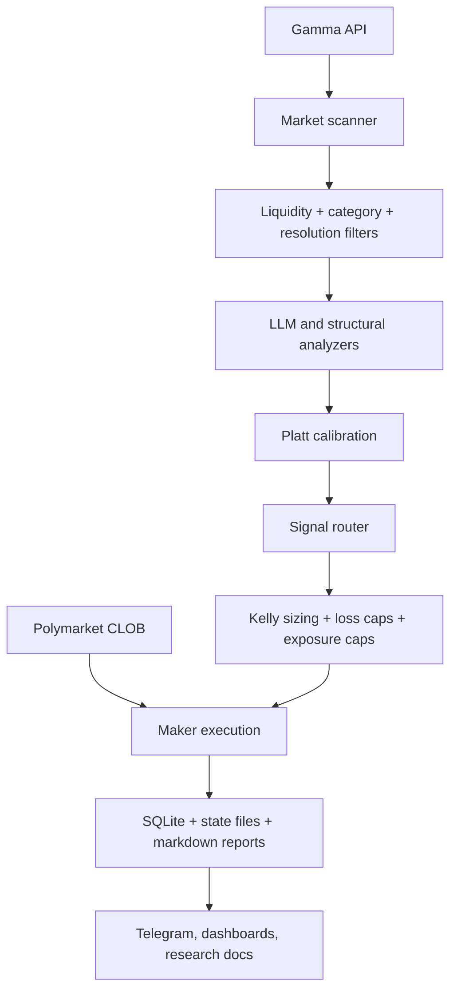
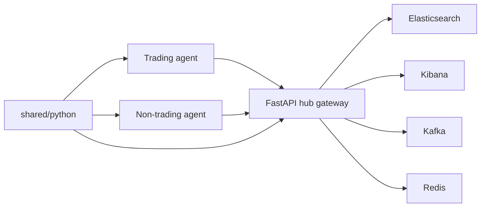

# Elastifund Architecture

## Overview

Elastifund has two loops:

1. The live trading loop scans markets, evaluates them, places maker orders, and records outcomes.
2. The research flywheel generates new hypotheses, tests them, records failures, and feeds the next build cycle.

There is now also a bootstrap `Elastifund.io` coordination layer for the broader dual-agent platform. The honest constraint is important: fully autonomous AI revenue generation is not a solved problem in 2026. The implementable version is a hub-and-spoke system with explicit paper defaults, agent registration, health checks, and opt-in external credentials.



## Dual-Agent Hub Layer

The new root-level scaffold adds a local Elastic-first hub stack plus a forkable bootstrap agent:



What is implemented now:
- a root `docker-compose.yml` that boots Elasticsearch, Kibana, Kafka, Redis, the hub gateway, and a bootstrap agent
- a setup wizard that generates `.env`, agent identity, and a runtime manifest
- a filesystem-backed hub registry for local registration and heartbeat flow
- `polymarket-bot` telemetry writes for bot heartbeats, cycle metrics, and trade snapshots into the Elastic hub aliases/data stream
- paper-safe preflight checks for trading and digital-product credentials
- an initial outbound-compliance lane in `nontrading/` plus a digital-product research lane in `nontrading/digital_products/`

What is not implemented yet:
- federated learning with Flower
- stake-weighted model aggregation
- production-grade capital allocation across many agents
- the recommended first production non-trading engine: a self-serve website audit and recurring monitor workflow
- live revenue guarantees of any kind

## Live Signal Flow

### 1. Scan

The bot discovers active Polymarket markets through the Gamma API and related public feeds. Structural modules can also contribute event groups, order-book observations, or cross-market relationships.

### 2. Filter

The first hard gate is not model intelligence. It is market selection.

- Liquidity and depth filters reject markets that are too thin to trade responsibly.
- Category routing skips or deprioritizes categories where the team has not observed durable model edge.
- Resolution-time filtering keeps capital focused on markets that resolve quickly enough to matter.

### 3. Analyze

There are two main analysis paths:

- Predictive path: an LLM estimates the probability of the event.
- Structural path: deterministic modules look for price arithmetic, dependency violations, or other market-structure dislocations.

The predictive path is explicitly anti-anchoring: the model sees the question, rules, and context, but not the current market price.

### 4. Calibrate

Raw model probabilities are not trusted at face value. A Platt-scaling layer is fit on resolved-market data and used to compress overconfident outputs before any signal is compared with price.

Why this matters:
- Trading decisions depend on small probability differences.
- Overconfident inputs make Kelly sizing dangerous.
- Calibration turns "sounds confident" into "has a measured error profile."

The public repo intentionally omits the exact live coefficients. The method and validation results are public; the active coefficients are not.

### 5. Signal

Once calibrated, the estimate is compared with the market price.

- If the calibrated probability is materially above market, that is a YES-side candidate.
- If it is materially below market, that is a NO-side candidate.
- Structural modules can bypass the LLM path entirely when the edge comes from market mechanics rather than forecasting.

## Asymmetric Thresholds And Favorite-Longshot Bias

Elastifund does not treat YES and NO identically. Historical testing showed that NO-side trades were materially stronger than YES-side trades, which is consistent with favorite-longshot bias in prediction markets: exciting low-probability outcomes get overpriced.

That leads to asymmetric thresholds:

- YES trades need stricter evidence.
- NO trades can clear a lower edge threshold.

This is a design decision grounded in backtest behavior, not ideology.

## Velocity Scoring

Edge is not enough. Lockup time matters.

The bot annualizes edge by time-to-resolution so that a small edge in a fast market can outrank a larger edge in a slow market:

```text
velocity_score = abs(edge) / max(resolution_hours / 24, 0.01) * 365
```

Interpretation:
- Faster-resolving markets recycle capital sooner.
- Slow markets need much stronger edge to justify occupying capital.

## Category Classification

Category routing is implemented with keyword and regex matching over market questions. The current classifier separates markets into buckets such as:

- politics
- weather
- economic
- geopolitical
- crypto
- sports
- financial_speculation
- fed_rates
- unknown

These categories are converted into priority levels:

- High-priority categories are eligible for predictive analysis.
- Low-priority categories are skipped or treated cautiously.
- The goal is not semantic purity. It is to prevent capital from drifting into categories that historically degrade calibration or execution quality.

## Risk And Execution

After a signal is generated, risk controls sit between conviction and capital.

- Kelly-style sizing is scaled down conservatively.
- Daily loss caps and exposure limits prevent one bad regime from dominating the bankroll.
- Open-position caps keep the book manageable.
- Execution is maker-first because taker fees have killed a large share of fast strategies in research.

The order path uses post-only behavior and records trade state for later reconciliation and reporting.

## Persistence And Reporting

The system records its work in SQLite databases, state files, markdown reports, and operations docs.

Important outputs:
- trade and signal logs
- backtest result tables
- `FAST_TRADE_EDGE_ANALYSIS.md`
- the failure diary
- public architecture and performance docs

The research record is part of the product. Negative results are preserved, not hidden.

## Public And Private Boundaries

Elastifund is open source, but not everything belongs in the public repo.

Public:
- architecture
- methodology
- test harnesses
- research logs
- backtest summaries

Private:
- credentials
- wallet addresses
- raw live trade databases
- deploy-time secrets
- exact live calibration coefficients

The rule is simple: publish the reasoning and the evidence, not the keys or the live edge settings.
