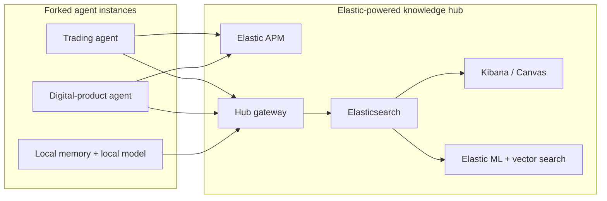

# Elastifund.io Pitch Deck

This file is a speaker-ready deck outline for Elastic leadership. It is intentionally honest about what exists now versus what is still architecture.

## Slide 1: Title

**Elastifund.io**

Elastic as the operating system for a supervised, self-improving AI revenue network.

Subhead:

- two revenue lanes: trading and digital products
- one shared knowledge hub on Elastic Stack
- one mission: direct 20% of net profit to veteran suicide prevention

## Slide 2: The honest thesis

Headline:

Fully autonomous revenue generation is still aspirational in 2026.

Speaker points:

- Single agents are brittle.
- Bounded automation already works in narrow lanes.
- Collective learning is the real moat, not the fantasy of one genius bot.
- Elastifund is best framed as supervised autonomy with continuous improvement.

## Slide 3: The product wedge

Headline:

Pair one proven trading lane with one practical non-trading lane.

Speaker points:

- Trading lane: prediction-market execution, maker-first, risk-capped, evidence-driven.
- Non-trading lane: digital-product niche discovery and product generation workflows.
- Shared allocator decides where budget goes.
- Shared knowledge hub lets every fork learn from the rest without sharing private edge details.

## Slide 4: What exists today

Headline:

The repo already contains the first credible slices.

Speaker points:

- live and paper trading infrastructure
- FastAPI dashboard and kill-switch controls
- flywheel control plane and peer-learning artifacts
- non-trading niche-discovery pipeline for digital products
- hub gateway scaffold with Elasticsearch, Kibana, Kafka, and Redis in Docker Compose

Proof paths:

- `polymarket-bot/src/app/dashboard.py`
- `flywheel/`
- `nontrading/digital_products/`
- `hub/app/main.py`
- `docker-compose.yml`

## Slide 5: Why Elastic is the backbone

Headline:

This platform only works cleanly if one stack handles search, telemetry, analytics, ML, and dashboards together.

Elastic product mapping:

- Elasticsearch: strategy registry, performance metrics, knowledge documents, vector search
- Kibana: leaderboards, operator dashboards, donor-impact reporting
- Canvas: executive-ready full-screen storyboards
- Elastic APM and EDOT: agent traces, dependency maps, failure hotspots
- Elastic ML: anomaly detection for strategy degradation and agent drift
- Logstash and Beats: ingest from forked agents at the edge
- ELSER and vector search: similarity search across strategy fingerprints and niche intelligence

## Slide 6: Architecture in one picture

Speaker point:

The hub shares metadata and telemetry, not private entry logic or account-level sizing.

## Slide 7: Why collective intelligence matters

Headline:

The winning bet is the ensemble, not the individual agent.

Speaker points:

- Elastifund borrows the logic of Numerai-style aggregation and crowd-forecasting systems.
- Weak standalone signals become useful when ranked, filtered, and combined.
- The platform value increases as more forks contribute evidence, even if no single fork is extraordinary.

## Slide 8: Why two revenue lanes matter

Headline:

Trading alone is cyclical; non-trading alone is operationally fragile.

Speaker points:

- Trading gives fast feedback and measurable P&L.
- Digital products offer lower regulatory risk and a clean story for knowledge compounding.
- Combined, they create diversification, more telemetry, and more opportunities for Elastic dashboards and anomaly detection to prove their value.

## Slide 9: Safety and credibility

Headline:

The project is only interesting if it is honest.

Speaker points:

- live, paper, and backtest are labeled separately
- kill switches and capital caps stay in the critical path
- negative findings are published
- exact private edge settings never leave the local agent
- nonprofit donations create real-world accountability

## Slide 10: Why this matters to Elastic internally

Headline:

Elastifund is a reference workload for the full Elastic platform, not a search demo.

Speaker points:

- one internal project exercises search, observability, ML, dashboards, and ingestion together
- the story is legible to customers because it is operational, not theoretical
- the architecture demonstrates why a unified platform beats stitching together six separate vendors

## Slide 11: 90-day roadmap

Headline:

Move from scaffold to instrumented pilot.

Milestones:

1. Wire agent registration, heartbeat, and telemetry into Elasticsearch.
2. Stand up Kibana leaderboards and health dashboards.
3. Promote the digital-product research lane from fixture-driven runs to real ingestion adapters.
4. Connect flywheel outputs to hub-visible scorecards.
5. Pilot with paper or micro-live forked instances before any broad rollout.

## Slide 12: The ask

Headline:

Sponsor a small internal incubation, not a hype launch.

Ask:

- Elastic Cloud credits or internal cluster sponsorship
- design-partner time from Search, Observability, and ML teams
- security and legal review before wider internal use
- a small pilot group focused on paper or tightly capped live runs

Close:

If Elastic wants a credible example of AI agents that actually need the whole stack, Elastifund is that example.
