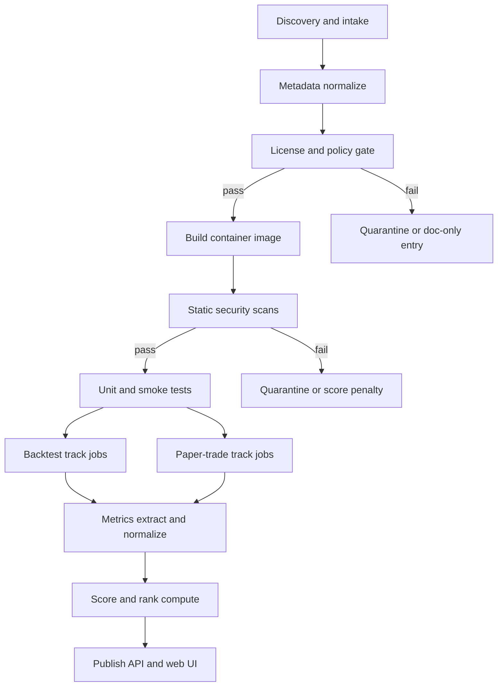

# Benchmark Methodology

**Status:** methodology published, rankings withheld until real T0-T5 runs exist  
**Spec version:** `2026.03-candidate1`  
**Source artifacts:** `research/competitive_inventory_benchmark_deep_research.md`, `research/trading_bot_inventory_benchmark_blueprint.md`, `inventory/data/systems.json`

## Why this page exists

Elastifund should not publish a fake "best trading bot" leaderboard. The useful product is a reproducible benchmark that scores systems on operational quality, execution honesty, and reproducibility before any profitability claims.

That means:

- methodology first
- clear disclosure of paper-trading mode
- separate candle-track and order-book-track systems
- no rankings until the first clean-room runs complete

## Current state

As of **March 7, 2026**:

- the catalog is saved in `inventory/data/systems.json`
- Tier-1 planned runs are Freqtrade, Hummingbot, and NautilusTrader
- the public API exists, but rankings remain empty until completed runs land

## Benchmark environment

- Host OS: Ubuntu 22.04 LTS
- Runtime policy: project-pinned container images, with Python 3.12 host tooling
- Container runtime: Docker, rootless where possible
- Network policy: outbound HTTPS only plus explicit sandbox and testnet allowlists
- Secrets policy: ephemeral paper or sandbox credentials only, rotated per run

## Execution labels

| Label | Meaning | Why it matters |
| --- | --- | --- |
| Internal simulation | System simulates fills on live or historical data using its own paper mode | Easiest to standardize, lowest realism |
| Exchange sandbox | System trades official demo or testnet infrastructure | Higher realism, higher integration burden |
| Deterministic simulation | Historical replay with a controlled broker or exchange model | Best for repeatable research-to-live comparisons |

Every run is also labeled as one of:

- `native`: use the system's own strategy primitives
- `translated`: port a canonical Elastifund benchmark strategy into the system API

## Data tracks

| Track | Use it for |
| --- | --- |
| Candle track | Directional, DCA, grid, and general execution bots |
| Order-book track | Market making, queue-position, latency-sensitive, and HFT-style systems |

Do not collapse these tracks into one leaderboard.

## T0-T7 matrix

| Test ID | Name | Primary question | Pass criteria |
| --- | --- | --- | --- |
| T0 | Reproducible build | Can a clean machine build and start the system without heroics? | Build succeeds from pinned instructions with no manual edits |
| T1 | Smoke paper run | How quickly does it make a first valid decision? | Valid paper decision within 15 minutes |
| T2 | Forced restart | Does it recover without corrupting state? | Recovery within 5 minutes, no corrupted state |
| T3 | Data-feed disconnect | Does it reconnect and log the gap honestly? | Reconnect within 2 minutes, gap logged |
| T4 | 24-hour soak | Does it leak memory or silent errors? | No crash and less than 10 percent RSS drift |
| T5 | 7-day run | Is it stable enough to trust operationally? | Crash-free at 99 percent or better uptime |
| T6 | Backtest parity | How far does paper behavior drift from research claims? | Divergence remains inside a versioned tolerance band |
| T7 | Execution fidelity | Are slippage and order semantics believable? | Observed fills stay inside the declared slippage band |

## Scoring rubric

| Category | Weight | Measures |
| --- | --- | --- |
| Reliability and operations | 25 | Uptime, restart behavior, reconnect logic, soak stability |
| Execution fidelity | 20 | Order semantics, fill honesty, slippage realism |
| Research and iteration speed | 15 | Reproducibility, build speed, data ergonomics |
| Integration breadth | 15 | Venue coverage, adapter quality, paper or sandbox support |
| Usability and onboarding | 10 | Docker-first setup, docs clarity, time to first paper run |
| Community and maintenance | 10 | Release cadence, contributor health, maintenance recency |
| License and legal | 5 | Copyleft burden, redistribution risk, license clarity |

## Pipeline

## Initial cohort

Initial six-system cohort:

- Freqtrade
- Hummingbot
- Jesse
- OctoBot
- NautilusTrader
- Lean

Cycle-3 execution starts with Freqtrade, Hummingbot, and NautilusTrader because they cover the main surface-area tradeoffs first:

- internal simulation vs exchange sandbox vs deterministic simulation
- execution bot vs reference engine
- permissive vs copyleft licensing

## API surface

The current benchmark API lives in the hub gateway:

- `GET /api/v1/benchmark/methodology`
- `GET /api/v1/bots`
- `GET /api/v1/bots/{bot_id}`
- `GET /api/v1/rankings`
- `GET /api/v1/runs`
- `GET /api/v1/runs/{run_id}/artifacts`
- `GET /api/v1/paper-status`

Current behavior is intentional: catalog and planned-run metadata are live, but rankings remain empty until completed benchmark evidence exists.

## Calibration Lane Disclaimer

The autoresearch calibration lane now has its own frozen benchmark package under [`benchmarks/calibration_v1/README.md`](../../benchmarks/calibration_v1/README.md) and its own append-only ledger under [`research/results/calibration/results.tsv`](../../research/results/calibration/results.tsv).

Those artifacts measure one thing only: calibration quality on a fixed historical holdout slice. They do not measure live trading profitability, fill quality, or operational readiness. A benchmark win is a research result and must still pass replay, paper, or shadow validation before it can influence deployment decisions.
