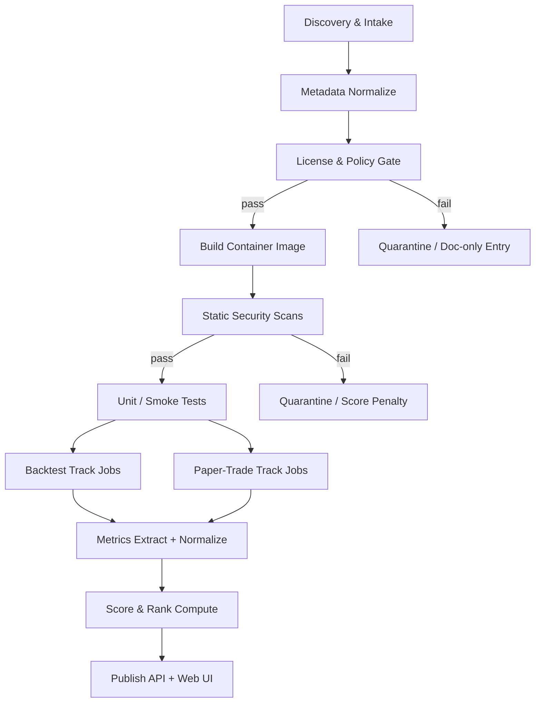

# Competitive Inventory & Benchmark Harness Deep Research

**Date:** 2026-03-07
**Integrated from:** imported deep research report on web-available trading bots
**Source artifact saved at:** `research/imports/trading_bot_inventory_deep_research_report_2026-03-07.md`
**Status:** canonical full artifact behind Dispatch #97
**Priority:** P2 website/research moat, not direct trading alpha

## Executive takeaway

The imported report is strategically useful, but not because it reveals a new trading edge. Its real value is that it maps the external bot landscape and defines a reproducible benchmark harness that Elastifund can publish as a public authority product.

The main conclusion is straightforward:

- There is no finite "complete list" of trading bots on the web. The correct product is a continuously updated catalog plus a standardized evaluation harness.
- The strongest comparison set is not prediction-market-native bots. It is crypto execution bots and general trading engines such as Freqtrade, Hummingbot, Jesse, OctoBot, NautilusTrader, and Lean.
- That means Elastifund is not entering a crowded prediction-market bot category. It has room to define the benchmark category itself.
- The benchmark harness is a website and credibility moat. It should follow the current P0/P1 alpha work, not displace it.

## Why this matters to Elastifund

This lane matters for four reasons:

1. It gives the website a defensible comparative claim. "We benchmark trading systems reproducibly" is stronger than "we built a bot."
2. It gives internal research a reference baseline. We can compare our execution, reliability, and calibration discipline against systems people already know.
3. It creates a contributor and recruiting magnet. Serious engineers and quants respect methodology more than marketing.
4. It forces discipline around safety, licensing, reproducibility, and paper-trading definitions before any public leaderboard goes live.

This is therefore a research and product-distribution lane, not a P0 trading lane.

## Catalog design

The imported report supports organizing the space into six practical buckets:

| Bucket | What belongs here | How Elastifund should treat it |
| --- | --- | --- |
| Open-source execution bots | Freqtrade, Hummingbot, Jesse, OctoBot | first benchmark cohort |
| Open-source engines/frameworks | NautilusTrader, Lean, Backtrader, Qlib, Superalgos | second-wave benchmarks and reference engines |
| Market-making / HFT-specialized tools | HftBacktest, Krypto-trading-bot, Tribeca | separate order-book track |
| Closed-source SaaS | 3Commas, Cryptohopper, Coinrule, WunderTrading, Bitsgap, TradeSanta, HaasOnline | black-box comparison only |
| Commercial self-hosted | Gunbot | black-box comparison with stronger sandboxing |
| Exchange-native bots | Pionex and exchange-built grid/DCA products | feature comparison, not fork-and-run evaluation |

The important framing: the benchmark is not "which bot makes the most money?" The benchmark is "which system is reproducible, safe, reliable, buildable, and operationally honest under controlled conditions?"

## Tier-1 initial cohort

The initial public cohort should stay tight. Six systems is enough to prove methodology without turning the harness into a months-long side project.

| System | Category | License | Why include it first | Preferred evaluation mode |
| --- | --- | --- | --- | --- |
| Freqtrade | OSS execution bot | GPL-3.0 | dominant open-source crypto bot, huge install base, dry-run workflow | internal simulation on live data |
| Hummingbot | OSS execution bot | Apache-2.0 | strongest open-source market-making reference point | paper connectors plus sandbox where possible |
| Jesse | OSS execution framework | MIT | research-to-live workflow and programmable strategy API | paper/live-sim hybrid |
| OctoBot | OSS execution bot | GPL-3.0 | broad retail feature set, explicit paper mode | internal paper mode |
| NautilusTrader | OSS engine | LGPL-3.0 | best research-to-live parity reference engine | deterministic simulation |
| Lean | OSS engine | Apache-2.0 | broad quant baseline outside crypto-native tooling | deterministic simulation and brokerage paper adapters |

This first batch covers the most important tradeoffs:

- execution bot vs research engine
- permissive vs copyleft licensing
- internal simulator vs exchange-paper model
- retail-first vs engineering-first product design

## Second wave and doc-only cohort

The next wave should include systems that are relevant but not ideal for the first public launch:

- HftBacktest: excellent for latency and queue-position realism, but it belongs on the order-book track rather than the basic candle track.
- Superalgos: useful as a large extensible platform, but operationally heavy.
- Backtrader and Qlib: valuable as research baselines, not direct exchange bot competitors.
- 3Commas, Cryptohopper, Coinrule, WunderTrading, Bitsgap, TradeSanta, Gunbot, HaasOnline: important for competitive context, but mostly black-box systems.

The legacy or down-ranked cohort should be clearly labeled:

- Zenbot: archived, historical baseline only.
- Gekko: unmaintained, historical reference only.
- Tribeca and Krypto-trading-bot: relevant if we add a separate low-latency market-making track, otherwise too operationally niche for the first public leaderboard.

## Benchmark harness design

The imported report's core contribution is the adapter-driven harness model. Every external system is treated as untrusted software that passes through the same lifecycle:

This is the right abstraction because the candidate systems are heterogeneous:

- Python, Rust, Node, C#, and mixed stacks
- CLI bots, web UIs, and full quant engines
- dry-run simulators, deterministic backtest engines, and exchange-connected paper environments

## Execution labels and fairness rules

The imported report makes an important fairness distinction that Elastifund should preserve publicly:

| Label | Meaning | Why it matters |
| --- | --- | --- |
| Internal simulation | system simulates fills on live or historical data using its own paper mode | easiest to run, lowest realism |
| Exchange sandbox | system trades against official demo/testnet infrastructure | higher realism, higher integration burden |
| Deterministic simulation | engine replays historical data with a controlled broker/exchange model | best for repeatable research-to-live comparisons |

Two more fairness labels should be explicit:

- **Native strategy**: use the bot's built-in strategy primitives exactly as designed.
- **Translated strategy**: port an Elastifund canonical strategy into the bot's API so runs are closer to apples-to-apples.

And the benchmark needs two separate data tracks:

- **Candle track** for trend, DCA, grid, and basic directional bots.
- **Order-book track** for market making, latency, queue-position, and microstructure-sensitive systems.

Do not collapse these tracks into one leaderboard.

## T0-T7 test matrix

Dispatch #97 already defined a solid public matrix. The imported report validates that direction. Keep the matrix fixed and versioned:

| Test ID | Name | Primary question |
| --- | --- | --- |
| T0 | Reproducible build | Can a clean machine build and start this system without heroics? |
| T1 | Smoke paper run | How quickly does it make a first valid decision? |
| T2 | Forced restart | Does it recover state without corrupting itself? |
| T3 | Data-feed disconnect | Does it reconnect and log the gap correctly? |
| T4 | 24-hour soak | Does it leak memory or accumulate silent errors? |
| T5 | 7-day run | Is it operationally stable enough to trust? |
| T6 | Backtest parity | How much does live paper behavior diverge from claimed research behavior? |
| T7 | Execution fidelity | Are order semantics and slippage handling believable? |

This keeps the benchmark anchored on operational truth instead of profitability theater.

## Metrics and scoring

The imported report's recommendation is directionally right: score performance, risk, execution realism, reliability, resources, and security separately. For Elastifund's public version, keep the existing 100-point rubric:

| Category | Weight | Notes |
| --- | --- | --- |
| Reliability and operations | 25 | uptime, restart behavior, reconnect logic |
| Execution fidelity | 20 | order semantics, slippage realism, fill handling |
| Research and iteration speed | 15 | build speed, backtest reproducibility, data ergonomics |
| Integration breadth | 15 | venues, adapters, paper/sandbox support |
| Usability and onboarding | 10 | Docker-first install, setup burden, docs clarity |
| Community and maintenance | 10 | activity, releases, contributor health |
| License and legal | 5 | copyleft risk, redistribution constraints |

Security should be surfaced in the detail pages and should also gate progression between stages:

- secrets scanning
- dependency vulnerability scanning
- static analysis
- container image scanning
- license scanning and SBOM generation

No system should reach exchange endpoints, even testnet endpoints, before those gates pass.

## License and compliance posture

The imported report reinforces a few non-negotiables:

- GPL/LGPL systems are benchmarkable, but public redistribution of modified containers increases compliance burden.
- Closed-source SaaS products are black-box entries. We compare features, paper modes, status telemetry, and incident history. We do not pretend we can benchmark internals we cannot inspect.
- No production API keys should ever be used in the harness.
- Sandbox keys must be isolated per bot and per run.
- Public pages should surface incident history separately from performance, especially for systems with known security disclosures.

Practically, this means MIT, Apache, and ISC projects are the easiest first cohort from a publishing standpoint, while GPL projects remain worth testing but need cleaner source and artifact handling.

## Website and API outputs

The imported report aligns cleanly with the existing website plan:

- methodology page first
- leaderboard second
- bot detail pages with provenance, version, license, and run history
- paper-status heartbeat and quarantine banners
- published artifacts and benchmark spec versions

The minimum public API should expose:

- `GET /api/v1/bots`
- `GET /api/v1/bots/{bot_id}`
- `GET /api/v1/rankings`
- `GET /api/v1/runs`
- `GET /api/v1/runs/{run_id}/artifacts`
- `GET /api/v1/paper-status`

This should be enough to power the website and allow outside users to inspect run provenance.

## Recommended sequence for Elastifund

The imported report should not change current alpha priorities. The correct sequencing is:

1. Finish the A-6 and B-1 empirical gates first.
2. In Cycle 2, publish the benchmark methodology page before any rankings.
3. In Cycle 2-3, build the adapter framework, artifact store, and metrics collection.
4. In Cycle 3, run Freqtrade, Hummingbot, and NautilusTrader through T0-T5.
5. In Cycle 4, expand to Jesse, OctoBot, and Lean, then add the first detail pages and leaderboard.

This is exactly the kind of P2 work that compounds the website moat without distracting from current trading validation.

## Bottom line

The imported report does not tell us to copy mainstream trading bots. It tells us something more useful:

- the external comparison set is large but legible
- the prediction-market-native field is still thin
- reproducible benchmarking is an open niche
- methodology-first publication can become a durable authority asset

That makes this research worth integrating deeply, but it should remain in the website/research lane until the current structural-alpha work either proves itself or dies cleanly.
