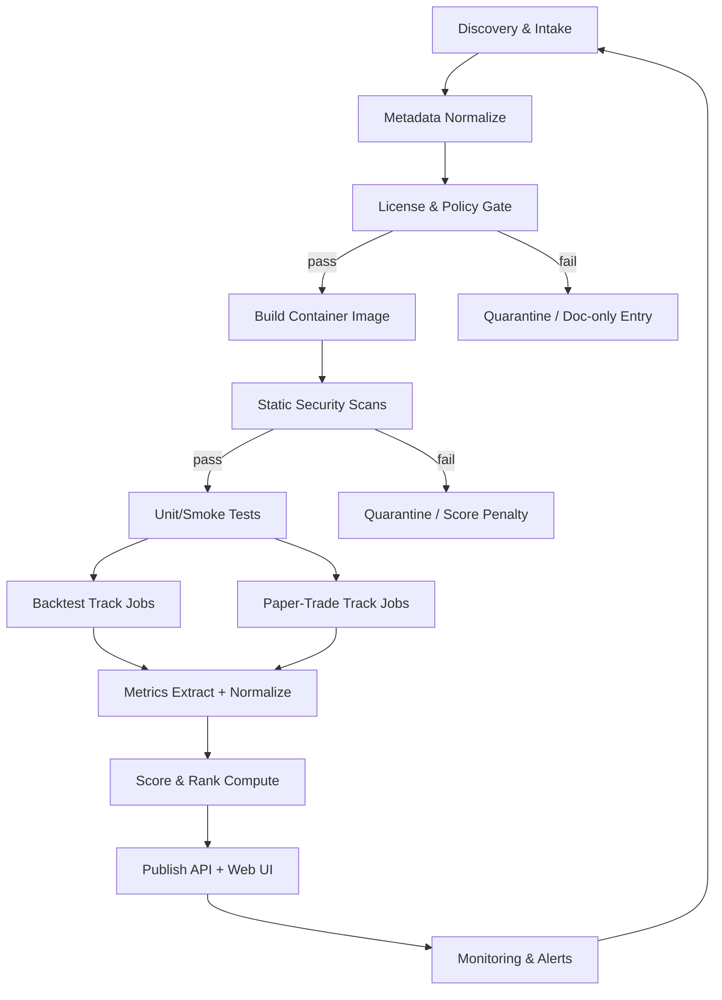

# Inventory and automated evaluation system for web-available trading bots

## Executive summary

A “full inventory of trading bots available on the web” is not a finite list: new repos launch daily, forks become the de facto maintained versions, commercial platforms change features, and exchange-native bots ship region-specific variants. The practical way to achieve what you want for Elastifund.io is a **continuously-updating catalog + automated, reproducible evaluation harness** that (a) discovers candidates, (b) normalizes metadata and installability, (c) runs standardized backtests and paper-trading forward tests, (d) scores performance + reliability + security posture, and (e) publishes rankings with an auditable methodology.

This report delivers:

A concrete “notable bots/frameworks” starting catalog (open-source + widely used closed-source), with **primary-source evidence**: official repos, docs, and exchange sandbox/testnet docs. citeturn18view0turn19view0turn17view0turn24view0turn20view1turn16search1turn16search2turn6search7turn7search2

A **reproducible architecture** to clone/fork, build, containerize, and run each system in **paper trading / simulated mode** using hardened sandboxing and strict secrets isolation, centered on exchange testnets/sandboxes where available. citeturn7search0turn7search1turn7search2turn7search23

A **standardized test suite**: datasets, metrics (return/risk, drawdown, trade quality, latency, resource use), and security checks (SAST, dependency vuln scan, secrets scan) to produce comparable results without hand-holding.

A CI/automation design with a data pipeline (artifact storage + metrics DB), monitoring, and an update cadence suitable for a public rankings page.

A legal/licensing compliance checklist, with special handling for strong copyleft licenses (GPL/LGPL/AGPL) and SaaS-style “network use” implications.

A proposed Elastifund.io rankings page layout and a public API spec to display rankings plus live paper-trading statuses.

Prioritized next steps:

1) Stand up the evaluation harness for **Tier-1 open-source execution bots** first (highest leverage: easiest to run locally + most interpretable). citeturn18view0turn19view2turn17view0turn15view2turn20view1  
2) Add exchange testnets/sandboxes (Binance, Bybit, Coinbase sandbox, OKX demo) with strictly-scoped keys and egress controls. citeturn7search0turn7search1turn7search2turn7search23  
3) Publish methodology + first leaderboard (“Buildability + Safety + Paper-trade health”), then iterate toward performance-based ranks only after dataset and slippage assumptions are locked.

## Landscape and inventory of notable trading bots and frameworks

### What “notable” means operationally

For a public benchmark, “notable” should be defined by a combination of:

Adoption/activity signals (GitHub stars/forks/releases, recent releases, active docs).

Evidence of real-world usage (e.g., maintained releases, vendor support, or active connector coverage).

Clear licensing (or explicitly proprietary with ToS).

Ability to run safely in an automated sandbox (containerizable, non-interactive startup path), or at least be scored as “doc-only / black-box” if closed-source.

This is why the catalog below is organized into:

Open-source “execution-capable bots” (can trade or simulate end-to-end).

Open-source frameworks/engines (research/backtest + execution substrate).

Closed-source + exchange-native platforms (black-box evaluation, heavier ToS constraints).

image_group{"layout":"carousel","aspect_ratio":"16:9","query":["Freqtrade web UI screenshot","Hummingbot dashboard screenshot","OctoBot trading bot interface screenshot","Superalgos trading platform interface screenshot"],"num_per_query":1}

### Tier-1 open-source execution-capable bots

| System | Primary repo/docs | License | Primary language | Venues / exchange integration | Strategy types (first-class) | Maturity/activity signals | Install/run complexity | Paper-trading / simulation support | Publicly visible security notes |
|---|---|---|---|---|---|---|---|---|---|
| **entity["organization","Freqtrade","open-source trading bot"]** | `https://github.com/freqtrade/freqtrade` citeturn18view0 | GPL-3.0 citeturn18view0turn27search2 | Python citeturn18view0 | Spot exchanges list includes Binance, Bybit, Kraken, OKX and others; CCXT-based for broad coverage. citeturn15view0turn8search1 | Custom strategies + backtesting + optimization/ML tooling (project scope statement). citeturn15view0 | 47.4k★, 9.9k forks; latest release “2026.2” (Feb 28, 2026). citeturn18view0 | Medium (Python deps; Docker recommended; published minimum hardware guidance). citeturn18view0 | “Dry-run” mode explicitly simulates trading and removes exchange secrets; project states it does **not** support sandbox accounts. citeturn8search4turn8search12 | Primary risk is operational: dry-run ≠ realistic order-book microstructure; project explicitly warns sandbox markets differ from real liquidity. citeturn8search12 |
| **entity["organization","Hummingbot","open-source bot framework"]** | `https://github.com/hummingbot/hummingbot` citeturn19view1 | Apache-2.0 citeturn19view2turn8search34 | Python citeturn19view0 | Centralized + decentralized connectors; repo claims usage across 140+ venues (reported volume context). citeturn19view2 | Market-making / arbitrage orientation is evident in topics + positioning. citeturn19view2 | 17.6k★; latest release v2.13.0 (Mar 2, 2026). citeturn19view0 | Medium (Docker Compose “easiest way” per repo). citeturn19view2 | Formal “paper trade” mode in docs; exchange-specific paper connectors exist (e.g., `binance_paper_trade`). citeturn27search0turn27search4 | Open-source; security posture should be evaluated via automated scanning; no single “incident” claim is made here. (Treat as “scan-required.”) citeturn19view2 |
| **entity["organization","Jesse","crypto trading framework"]** | `https://github.com/jesse-ai/jesse` citeturn17view0 | MIT citeturn17view0 | Python (core) + JS (UI) citeturn17view0 | Spot/futures and DEX support is claimed in the “Live/Paper Trading” section; exchange list is docs-driven. citeturn17view0 | Research/backtest/optimize + live/paper; extensive indicator + metrics tooling. citeturn17view0 | 7.5k★; 3,199 commits; no GitHub releases published. citeturn17view0 | Medium (Dockerfile present; self-hosted). citeturn17view0 | Explicit “Live/Paper Trading” capability in README. citeturn17view0 | Positions itself as “self-hosted and privacy-first.” Treat as claim; validate with threat model + scans. citeturn17view0 |
| **entity["organization","OctoBot","crypto trading bot"]** | `https://github.com/Drakkar-Software/OctoBot` citeturn24view2 | GPL-3.0 citeturn24view0 | Python citeturn24view0 | “15+ exchanges” and a concrete list (Binance, Coinbase, Bybit, OKX, etc.) + CCXT support. citeturn15view2 | Built-in grids, DCA, TradingView-triggered automation, and AI connectors are explicitly marketed in README. citeturn15view2 | 5.4k★; 120 releases; latest release 2.0.16 (Dec 29, 2025). citeturn24view0 | Medium (Docker, executable, or source install pathways documented). citeturn8search37 | “Paper money” live test and “risk-free paper trading” are explicitly described. citeturn15view2 | GPL licensing requires strict compliance if redistributed or modified; treat as compliance-sensitive. citeturn24view0turn27search10 |
| **entity["organization","Superalgos","crypto trading platform"]** | `https://github.com/Superalgos/Superalgos` citeturn20view1 | Apache-2.0 citeturn20view1turn9search0 | JavaScript citeturn20view1 | Multi-component platform; venue coverage is implementation-dependent and should be probed by harness/connector enumeration. citeturn20view1 | Explicit “Backtesting Session” + “Paper Trading Session” concepts; visual/systematic strategy workflow. citeturn27search1turn27search29 | 5.3k★, 6.1k forks; last tagged release shown as 1.6.1 (Nov 2, 2024) though repo updates continue. citeturn20view1turn9search8 | High (large platform; multi-layer runtime; OS service guidance appears in README). citeturn20view1 | “Paper Trading Session” is a first-class mode per docs. citeturn27search1turn27search13 | Security posture must be enforced by sandboxing because it is a large, extensible runtime with plugins. citeturn20view1 |
| **entity["organization","HftBacktest","hft backtesting tool"]** | `https://github.com/nkaz001/hftbacktest` citeturn20view2 | MIT citeturn20view2turn9search3 | Rust + Python citeturn20view2 | “Real-world crypto trading examples for Binance and Bybit” are stated; venue integrations are example-driven. citeturn20view2 | HFT market-making + latency + queue position modeling; Level-2/Level-3 replay. citeturn20view2turn9search35 | 3.8k★; latest release Dec 10, 2025. citeturn20view2 | High (full tick/order-book data + Rust toolchain). citeturn20view2 | Strong simulation/backtest focus; “paper” is typically achieved through replay + deterministic sim rather than exchange testnets. citeturn20view2 | Treat as “high-risk if misused” due to speed/market-making orientation; enforce strict sandbox + rate limits. citeturn20view2 |
| **entity["organization","Krypto-trading-bot","low latency market maker"]** | `https://github.com/ctubio/Krypto-trading-bot` citeturn21view1 | MIT (COPYING) citeturn9search21 | C++ (plus TS tooling/UI) citeturn21view0 | “Compatible exchanges” + topics include Coinbase/Kraken/BitMEX/Binance, etc. (Connector list must be enumerated by code scan). citeturn21view0turn21view1 | Low-latency market making; web UI + CLI. citeturn20view3 | 3.7k★; latest release Sep 17, 2024. citeturn21view0 | High (compiler toolchain; recommends non-Docker host install; uses curl/OpenSSL). citeturn20view3 | No single “paper mode” claim captured in primary docs excerpt; evaluation should prefer exchange testnets/sandbox keys + strict risk limits. citeturn20view3turn7search0 | High operational risk category; treat as untrusted code and isolate network + filesystem. citeturn20view3 |
| **entity["organization","tribeca","market making bot"]** | `https://github.com/michaelgrosner/tribeca` citeturn22view0 | ISC citeturn13view0 | TypeScript/Node.js citeturn23view0 | Supports several exchanges + includes a “null” in-memory exchange for testing (per config docs). citeturn23view0 | Market making + backtester + web client are explicit. citeturn22view0 | 4.1k★; latest release Aug 26, 2015. citeturn23view0 | High (very old Node version requirements; MongoDB; likely heavy dependency drift). citeturn22view0 | Has a built-in “null” exchange for test runs; also includes a backtester. citeturn23view0 | Legacy/unmaintained risk; default stance should be “build-only + static scan” unless pinned to known-good forks. citeturn23view0 |
| **entity["organization","Kelp","stellar dex trading bot"]** | `https://github.com/stellar-deprecated/kelp` citeturn22view1 | Apache-2.0 citeturn22view1 | Go citeturn23view2 | Stellar DEX + CCXT-based centralized exchange support (Binance/Kraken/Coinbase Pro referenced). citeturn22view1 | Market making (spreads), liquidity provisioning, orderbook mirroring. citeturn22view1 | 1.1k★; latest release Nov 5, 2021; repository is in a deprecated org namespace. citeturn23view2turn22view1 | Medium (binaries, Docker, or source build options documented). citeturn22view1 | Primarily live bot; paper testing depends on venue/testing setup; not claimed as a core mode in README excerpt. citeturn22view1 | Treat as “legacy” due to deprecated status; prefer forks if production use is intended. citeturn22view1 |
| **entity["organization","Zenbot","nodejs crypto bot"]** | `https://github.com/DeviaVir/zenbot` citeturn22view2turn27search15 | MIT citeturn22view2 | Node.js citeturn22view2 | Exchange compatibility is a known weakness for archived bots; treat as fork-driven. citeturn27search11 | CLI bot; “paper-trading” appears as a topic label. citeturn22view2 | 8.3k★; repository archived Feb 15, 2022. citeturn27search11 | High (dependency drift; MongoDB; Node ecosystem changes). citeturn22view2turn27search11 | Historically supported simulation/backtest workflows, but current state is “archived”; evaluate forks only. citeturn27search11 | Archived status is itself the security signal; default to “do not run with real keys.” citeturn27search11 |
| **entity["organization","Gekko","crypto trading bot"]** | `https://gekko.wizb.it/` citeturn0search5 | (Repository/license varies by fork) citeturn0search5 | Node.js (historical) citeturn0search5 | N/A (project is explicitly “no longer maintained”). citeturn0search5 | N/A | Not maintained. citeturn0search5 | N/A | N/A | Unmaintained; include only as historical reference. citeturn0search5 |

### Tier-1 open-source engines and research frameworks

These projects are often the substrate for “Elastifund-native” systems: you implement strategy logic in a deterministic framework, then compare against full bots.

| System | Primary repo/docs | License | Primary language | Markets / venues supported | Core capabilities | Maturity/activity signals | Install/run complexity | Paper-trading / simulation support | Notes for Elastifund benchmarking |
|---|---|---|---|---|---|---|---|---|---|
| **entity["organization","NautilusTrader","rust trading engine"]** | `https://github.com/nautechsystems/nautilus_trader` citeturn25view0 | LGPL-3.0 citeturn25view0 | Rust core + Python control plane citeturn25view0 | Multi-asset / multi-venue; adapters for REST/WebSocket venues. citeturn25view0 | Research + deterministic simulation + live execution with parity semantics. citeturn25view0 | 21k★; releases ongoing; example release “1.224.0 Beta” (Mar 3, 2026). citeturn25view0 | High (Rust toolchain + Python; but Docker deploy is supported). citeturn25view0 | Deterministic simulation is a core concept; paper trading can be implemented as “live data + simulated broker.” citeturn25view0 | Strong candidate for Elastifund “reference engine” because it explicitly targets research-to-live parity. citeturn25view0 |
| **entity["organization","Lean","open-source trading engine"]** | `https://github.com/QuantConnect/Lean` citeturn25view1turn26view0 | Apache-2.0 citeturn26view0 | C# + Python citeturn26view0 | Multi-asset markets via brokerage/data integrations (docs-driven). citeturn25view1 | Event-driven engine for backtests and live trading; CLI tool supports local workflow. citeturn25view1 | 17.6k★, 4.5k forks. citeturn26view0 | High (dotnet build + data bundles), but common paths are documented. citeturn26view0 | Supports deploy/run patterns; paper depends on brokerage integrations; treat as harness-defined. citeturn25view1 | Good baseline for “general quant platform” comparisons; strategy portability differs from crypto-native bots. citeturn25view1 |
| **entity["organization","Qlib","quant investment platform"]** | `https://github.com/microsoft/qlib` citeturn25view2turn29view0 | MIT citeturn29view0turn14search0 | Python citeturn29view0 | Quant research pipeline; data + modeling + backtesting + “order execution” in scope. citeturn25view2turn29view2 | End-to-end ML pipeline + backtesting; covers alpha/risk/portfolio/execution chain. citeturn25view2 | 38.4k★; latest release v0.9.7 (Aug 15, 2025). citeturn29view0 | High (ML stack dependencies; data pipeline complexity). citeturn29view2 | Primarily a research + backtest platform; “paper” is usually implemented via simulated execution layers. citeturn25view2turn29view2 | Useful for benchmarking ML-based signal generation and portfolio construction—less “bot platform” and more “quant stack.” citeturn25view2 |
| **entity["organization","backtrader","python backtesting engine"]** | `https://github.com/mementum/backtrader` citeturn28search0 | GPL-3.0 citeturn28search0 | Python citeturn25view3 | Live data/trading adapters (Interactive Brokers, Oanda referenced) + broker simulation. citeturn25view3 | Backtesting + broker simulation + indicators/analyzers (Sharpe ratio analyzer mentioned). citeturn25view3 | 20.6k★; no GitHub “releases” objects but many tags. citeturn28search0turn28search4 | Medium (pure Python; common in research stacks). citeturn25view3 | Broker simulation is built-in; paper trading is typically “live feed + simulated broker.” citeturn25view3 | Strong baseline for strategy metrics; not a crypto-exchange-native execution bot by default. citeturn25view3 |
| **entity["organization","Zipline","python backtesting library"]** | `https://github.com/quantopian/zipline` citeturn28search2turn28search6 | Apache-2.0 citeturn28search6 | Python citeturn28search2 | Historically equities-focused research engine. citeturn28search2 | Event-driven backtesting engine; historically powered Quantopian workflows. citeturn28search2turn28search6 | ~19.5k★; explicit “NO LONGER MAINTAINED” issue exists—forks are required for serious use. citeturn28search6turn28search10 | High (data bundles + maintenance drift). citeturn28search10 | Paper trading is not a stable core promise; treat as “backtest-only unless fork adds forward-testing.” citeturn28search38turn28search10 | Include as legacy baseline; prefer maintained forks for any automated CI system. citeturn28search10 |
| **entity["organization","PyAlgoTrade","python trading library"]** | `https://github.com/gbeced/pyalgotrade` citeturn14search15 | Apache-2.0 citeturn14search11 | Python citeturn14search15 | Bitstamp integration for paper/live trading is explicitly documented; project is deprecated. citeturn14search15 | Event-driven backtesting; some live/paper trading hooks. citeturn14search15 | Repo archived (Nov 13, 2023) and marked “deprecated.” citeturn14search35turn14search15 | Medium/High (dependency drift). citeturn14search15 | Paper trading is explicitly stated as possible (Bitstamp), but treat as legacy. citeturn14search15 | Benchmark only for historical interest; not a “leading” maintained system today. citeturn14search15 |

### Widely used closed-source platforms and exchange-native bots

Closed-source systems require **black-box evaluation**: you cannot fork most of them, and you often cannot run their code in your CI. Instead you score: integration breadth, paper/demo features, security posture disclosures, and (where permitted) API-driven paper accounts.

| Platform | Website/docs | License/ToS | Delivery model | Paper/demo trading support | Strategy styles emphasized | Notable security issues/disclosures (primary sources) |
|---|---|---|---|---|---|---|
| **entity["company","Coinrule","no-code trading platform"]** | `https://help.coinrule.com/` citeturn5search38 | Proprietary | SaaS | “Demo exchange” runs strategies in paper trading (mirroring trades) with virtual allocation. citeturn5search38 | Rule templates + automation; paper trading positioning is explicit. citeturn5search8turn5search38 | No specific breach statement captured in reviewed primary sources; require security questionnaire + monitoring. citeturn5search38 |
| **entity["company","WunderTrading","trading bot platform"]** | `https://help.wundertrading.com/` citeturn5search20 | Proprietary | SaaS | Explicit “paper trading account” and help-center workflow exist. citeturn5search20turn5search9 | Copy trading, DCA, signal bots (vendor positioning). citeturn5search13turn5search20 | No specific breach statement captured here; treat as “needs due diligence.” citeturn5search20 |
| **entity["company","TradeSanta","trading bot platform"]** | `https://tradesanta.com/` citeturn5search31 | Proprietary | SaaS | Not presented as a first-class “paper” mode in primary sources reviewed; evaluation should be via small-size live test or vendor demo if available. citeturn5search31 | Template-driven bots; common strategies (grid/DCA-style) in positioning. citeturn5search31turn5search18 | No primary-source breach statement captured; treat as “scan via vendor disclosures.” citeturn5search31 |
| **entity["company","3Commas","crypto trading platform"]** | `https://3commas.io/` citeturn16search1 | Proprietary | SaaS | Paper trading is not established from primary sources reviewed here; often evaluated via exchange sandbox/testnet with API keys plus strict permissioning. citeturn16search1turn7search0 | Bot marketplace + automation (platform scope). citeturn16search1 | Disclosed a major API-key disclosure incident (Dec 2022) and published incident notices/FAQ; later reporting describes unauthorized access to customer account data (Oct 2023). citeturn16search0turn16search1turn16search11 |
| **entity["company","Cryptohopper","trading bot platform"]** | `https://www.cryptohopper.com/` citeturn16search2 | Proprietary | SaaS | (Not established from primary sources in this crawl; verify in vendor docs.) citeturn16search2 | Marketplace/social features (general positioning). citeturn16search2 | Vendor published a security breach update describing a compromised access token and recommended user actions (Jan 18, 2024). citeturn16search2 |
| **entity["company","Bitsgap","trading bot platform"]** | `https://bitsgap.com/` citeturn16search3 | Proprietary | SaaS | (Paper/demo not established from primary sources in this crawl; verify in vendor docs.) citeturn16search3 | Grid/DCA bots are core product positioning (platform positioning appears in vendor content). citeturn5search30 | Vendor states it cannot disclose all security standards but describes security focus. citeturn16search3 |
| **entity["company","Gunbot","self-hosted trading bot"]** | `https://www.gunbot.com/` citeturn5search25 | Proprietary | Self-hosted paid | (Paper mode not established from primary sources reviewed; treat as “testnet-forward” system.) citeturn5search25 | Connector breadth (CEX + some DeFi per vendor). citeturn5search25 | Security posture is vendor-claimed; require binary provenance + sandboxing. citeturn5search25 |
| **entity["company","HaasOnline","crypto trading software"]** | `https://haasonline.com/` citeturn5search11 | Proprietary | SaaS + software variants | (Paper/backtest capability not established from primary sources in this crawl; verify in vendor docs.) citeturn5search11 | Arbitrage/automation strategies are marketed. citeturn5search36 | No primary-source breach statement captured; require due diligence. citeturn5search11 |
| **entity["company","Pionex","crypto exchange bots"]** | `https://support.pionex.com/` citeturn6search26turn6search14 | Proprietary | Exchange-native bots | Bot docs emphasize automated grid/DCA bots (real trading); “paper” depends on exchange features. citeturn6search26turn6search14 | Grid + DCA bots (documented). citeturn6search26turn6search14 | No primary-source breach statement captured here; require exchange-level due diligence. citeturn6search26 |
| Exchange-native bots (Binance/Bybit/OKX) | Official help centers | Proprietary | Exchange-native | Generally real trading with configured parameters; treat as “black-box strategy runner” unless an exchange offers a dedicated demo environment. citeturn6search7turn6search4turn7search15turn7search23 | Grid/DCA bots are explicitly described (varies by exchange). citeturn6search7turn6search25turn6search12turn6search31 | Security posture is exchange-dependent; your evaluation should prefer demo/testnet environments where available. citeturn7search0turn7search1turn7search2turn7search23 |

## Reproducible build and paper-trading deployment architecture

### Core idea: a “Bot Evaluation Harness” with adapters

Treat every bot/framework as an untrusted package. The harness provides a uniform lifecycle:

1) **Acquire**: clone repo at a pinned commit (and optionally fork into a controlled org for patching build scripts).  
2) **Inspect**: license detection, dependency graph capture, and static checks before execution.  
3) **Build**: containerize into a standardized runtime image.  
4) **Run**: execute either a backtest job or a paper-trading “forward test” job, emitting standardized metrics.  
5) **Observe + record**: logs, metrics, artifacts, and a provenance record (repo SHA, container digest, dataset version).  
6) **Score**: compute ranking outputs and publish.

This adapter model is essential because the bots above differ radically (CLI-based vs web UI vs full platforms; Python vs Node vs Rust). citeturn18view0turn22view0turn20view2turn20view1

### Safe paper-trading environments to standardize on

To avoid real funds and reduce ToS risk, prefer exchange-provided testnets/sandboxes:

**entity["company","Binance","crypto exchange"]** Spot Testnet: base endpoint `https://testnet.binance.vision/api` (REST) and `wss://ws-api.testnet.binance.vision/ws-api/v3` (WebSocket API endpoint). citeturn7search0turn7search12  
**entity["company","Bybit","crypto exchange"]** Testnet: REST base endpoint `https://api-testnet.bybit.com` per Bybit API docs. citeturn7search1  
**entity["company","Coinbase","crypto exchange"]** Exchange Sandbox: separate login/API keys from production; “subset of production order books”; supports all exchange functionality except transfers; unlimited fake funds. citeturn7search2  
**entity["company","OKX","crypto exchange"]** Demo trading/test environment exists; OKX indicates demo trading API keys can be created via “Demo trading.” citeturn7search23turn7search27turn7search15

When a bot only supports “paper” internally (e.g., Hummingbot’s paper connectors or Freqtrade’s dry-run), you still run it inside the same harness, but mark the result as **“simulated execution (internal)”** vs **“exchange-sandbox execution (external)”** because realism differs. citeturn8search12turn27search0turn27search4

### Containerization and infra blueprint

A practical “no budget constraints” build is:

A Kubernetes cluster (or equivalent) that runs three job types: build jobs, backtest jobs, paper-trade jobs.

A private artifact registry for base images and built bot images.

An object store for datasets + run artifacts.

A Postgres (metadata + runs) + time-series store (metrics).

This architecture is implied by the scale of community repositories and release cadences (e.g., Freqtrade and Hummingbot shipping frequent releases). citeturn18view0turn19view0

Key container patterns:

Python bots: build with pinned Python (e.g., Freqtrade requires Python ≥3.11 per README). citeturn18view0  
Node bots: build with pinned Node version (Tribeca’s README references Node v7.8+; treat as legacy and isolate). citeturn22view0  
Rust: build with cargo, then multi-stage image to slim runtime (HftBacktest + NautilusTrader are Rust-centric). citeturn20view2turn25view0  
Dotnet: build/run for Lean (dotnet build instructions are in README). citeturn26view0

### Secrets management and blast-radius control

The safety model should assume any cloned bot may be malicious or compromised.

Recommended controls:

Ephemeral testnet-only keys; never reuse keys between bots/runs.

Keys must be scoped to “trade only” (no withdrawal) wherever supported; Coinbase sandbox separates keys from production by design. citeturn7search2

Network egress restrictions: bots should only reach allowlisted endpoints (the relevant testnet/sandbox + dependency proxies).

Filesystem restrictions: read-only root filesystem when possible; mount only minimal writable volumes for temp/logs.

Separate service accounts per bot, per run; no shared cluster credentials.

A hard kill switch and run timeouts (e.g., terminate any paper-trade run that exceeds allowed order rate, memory, or error threshold).

### Cost estimates (vendor-neutral, reproducible)

Because cloud pricing is volatile, the most reproducible “cost estimate” is consumption in:

Build CPU-hours = (#repos rebuilt per day) × (avg build minutes) × (vCPU).  
Backtest CPU-hours = (#bots × #datasets × #strategies) × (avg backtest runtime).  
Paper-trade hours = (#bots under continuous forward test) × (hours per day).  
Storage = (datasets + logs + artifacts) in GB-month; plus retention windows.

A realistic Tier-1 initial scope (10–15 open-source bots + 5–10 frameworks):

Daily rebuild+scan: ~50–150 vCPU-hours/day (most repos build in minutes; heavy ML stacks cost more). citeturn29view2turn20view2  
Backtest batch (nightly): ~200–1,000 vCPU-hours/night depending on dataset size and number of strategy benchmarks.  
Forward test: “always-on” pods—e.g., 10 bots × 24h with 1–2 vCPU each = 240–480 vCPU-hours/day.

## Standardized evaluation test suite

### Dataset strategy: “two-track” data for fairness

A single dataset is not fair across bot types. Use two tracks and label results accordingly:

Candle track (OHLCV): fair for trend/mean-reversion/grid-style bots and for platforms like Freqtrade, Jesse, OctoBot. citeturn15view0turn17view0turn15view2

Order-book/tick track (L2/L3): required for market-making/HFT systems like HftBacktest and low-latency market makers. citeturn20view2turn9search35turn20view3

For equities/ML stacks:

Qlib’s repo describes that its dataset is created from public data collected via crawler scripts and notes that the data is collected from Yahoo Finance (with data quality caveats). citeturn29view2  
Zipline historical default bundles are legacy; project maintenance status is explicitly flagged as “no longer maintained,” so any dataset workflows should be provided by forks or external pipelines. citeturn28search10

### Benchmark strategy set: normalize what can be normalized

Define a small canonical set of strategies that can be expressed across systems:

Momentum crossover (e.g., EMA cross).

RSI mean reversion.

Grid trading (where supported and comparable).

Market making with spread/quote depth (tick track only).

DCA accumulation (where supported).

Then label each strategy run as:

Native (bot’s built-in implementation; closest to how users run it).

Translated (Elastifund canonical strategy compiled into the bot’s strategy API).

“Translated” is essential for apples-to-apples comparisons, but only feasible when the bot exposes a programmable strategy interface (Freqtrade, Jesse, Hummingbot, Lean, NautilusTrader). citeturn15view0turn17view0turn19view2turn25view0turn25view1

### Metrics: performance, risk, execution, reliability, resources

At minimum, compute:

Return/risk: CAGR (if applicable), Sharpe, Sortino, max drawdown, Calmar; plus volatility and downside deviation.

Trade quality: win rate, profit factor, avg trade, exposure time, turnover.

Execution realism labels: simulated vs sandbox/testnet; expected slippage model version.

Latency (where relevant): time from signal → order submit; cancel latency; effective order rate. (Especially relevant for low-latency market makers that claim sub-millisecond reactions.) citeturn20view3turn22view0turn20view2

Reliability: crash rate, memory growth over time, reconnect success, order reject rate.

Resource use: CPU%, RSS memory, network egress.

Important: some frameworks explicitly surface analyzer metrics (Backtrader mentions analyzers including Sharpe Ratio). citeturn25view3

### Security/static-analysis checks

Treat security as a scored dimension, not a checkbox.

Suggested automated checks per language/runtime:

Secrets scanning: scan repo + build logs for leaked keys and suspicious patterns.

Dependency vulnerability scanning: pip/npm/cargo/go modules; fail builds above a severity threshold.

SAST: language-appropriate analyzers (e.g., Python bandit-style checks; JS taint checks; Rust unsafe usage scans).

Container image scanning: known CVEs in base images and OS packages.

License scanning: ensure the detected license matches declared license and capture third-party notices.

Apply strict policy gates before any code is allowed to reach exchange endpoints (even testnet).

## Automation and CI/CD for continuous benchmarking

### Pipeline design principles

Reproducibility: every run must be traceable to (repo SHA, container digest, dataset version, benchmark spec).

Safety: no bot reaches exchange endpoints without passing static gates and running in a restricted sandbox.

Continuity: daily “freshness” checks for hot repos; weekly or biweekly for slow-moving ones.

### Mermaid flowchart for the automated pipeline

### Data pipeline and storage

A practical schema:

Catalog DB (Postgres): bots, repos, versions, licenses, adapters, installation recipes.

Run DB: run_id, bot_version, dataset_version, benchmark_spec, environment label (simulated vs exchange sandbox), status, timestamps.

Artifacts: logs, configs, equity curve series, trade blotter, security scan reports, container SBOM.

Metrics TSDB: latency histograms, CPU/mem, order rates, error counts.

This supports “live paper-trading statuses” on Elastifund.io without scraping ephemeral logs.

### Update cadence

Daily: check for repository updates and rerun lightweight gates (license drift, dependency diff, build).

Nightly: backtests for Tier-1 bots across the canonical dataset/strategy set.

Continuous: forward paper-trade runs for the current “Top N” open-source bots, plus Elastifund internal systems.

Weekly: deep security scans and larger datasets.

This aligns with observed active release cadence in key projects (Freqtrade and Hummingbot both show frequent releases). citeturn18view0turn19view0

## Legal, licensing, and compliance checklist

### License classification and obligations

You must treat the evaluation harness as a potential “distribution” channel if you publish modified binaries, containers, or hosted versions.

Strong copyleft (GPL-3.0): distributing modified versions generally requires making corresponding source code available under GPL terms; GPL is a copyleft license designed to keep derivatives free. citeturn27search10turn27search26  
Examples in this catalog include Freqtrade, OctoBot, Backtrader (GPL-3.0). citeturn18view0turn24view0turn28search0

Weak copyleft (LGPL-3.0): typically allows linking with proprietary components under constraints; still compliance-sensitive. NautilusTrader declares LGPL-3.0. citeturn25view0

Permissive (MIT/Apache/ISC): generally easier for internal benchmarking and even redistribution, but still requires preserving copyright/license notices. Examples: Hummingbot (Apache-2.0), Qlib (MIT), HftBacktest (MIT), Tribeca (ISC). citeturn19view2turn29view0turn20view2turn13view0

### Compliance checklist (actionable)

Maintain a machine-generated SBOM per bot image and keep raw license texts.

For each bot, store: detected license, NOTICE requirements (if any), and third-party dependency licenses.

If you modify and redistribute a GPL/LGPL project (including shipping a Docker image publicly), ensure you can produce the exact corresponding source for that build.

For SaaS-style bots you do not redistribute: still ensure you are not violating trademark usage or ToS on published pages.

For closed-source platforms: you cannot legally “pull their code” unless explicitly licensed; treat as doc-only and black-box tests.

### Exchange terms and safety constraints

Never use production API keys in benchmarking.

Prefer official sandboxes/testnets (Binance, Bybit, Coinbase sandbox, OKX demo) as described earlier. citeturn7search0turn7search1turn7search2turn7search23

Enforce rate limits and “kill switches” to avoid service abuse; even testnets can be rate-limited and disruptive if hammered.

### Public security disclosures you should reflect in rankings

Your Elastifund.io page should surface “security incident history” as a separate dimension, not as clickbait.

3Commas published notices about an API data disclosure incident (Dec 2022) and an FAQ discussing leaked API keys; third-party reporting later described an Oct 2023 breach involving unauthorized access to customer account data. citeturn16search0turn16search1turn16search11  
Cryptohopper published a breach update about a compromised access token and recommended user actions. citeturn16search2

## Elastifund.io rankings page and public API design

### Page layout proposal

A high-trust rankings page needs to make methodology and reproducibility visible.

Landing (Leaderboard):

Top ranked (overall).

Category tabs: “Open-source bots,” “Frameworks,” “Commercial platforms,” “Exchange-native bots.”

Filters: asset class (crypto/FX/equities), strategy type (grid, DCA, market making, momentum), execution label (simulated vs exchange sandbox), license type, maintenance status (active vs archived).

Columns (dense but readable): Overall score, Buildability, Paper-trade Health, Backtest Score (by track), Security score, License risk, Last evaluated timestamp, Current version.

Bot detail page:

Provenance: repo URL, commit SHA, image digest, license + dependencies.

Install complexity notes (auto-generated from adapter).

Run history chart: last 30 days paper status (up/down), backtest deltas, regression alerts.

Security panel: dependency vulns trend, secrets scan results, SAST summary.

Methodology panel: which strategy benchmarks were used, fee/slippage model, dataset version.

Live paper trading status:

Real-time “heartbeat” (last tick, last order, last error).

Position snapshot (paper): exposure, cash, PnL (paper).

Alert banners when a bot is quarantined (e.g., failed security gate).

### Public API sketch

A simple REST + optional WebSocket design:

`GET /api/v1/bots`  
Returns catalog entries with normalized metadata (name, type, license, repo, languages, adapters available, maintenance flags).

`GET /api/v1/bots/{bot_id}`  
Full bot record: versions, install recipe, supported tracks, known limitations, license obligations.

`GET /api/v1/rankings?category=open_source&track=candles&window=30d`  
Computed leaderboard with score breakdown and confidence labels.

`GET /api/v1/runs?bot_id=...&since=...`  
List of evaluation runs; includes status, artifacts pointers, metrics summaries.

`GET /api/v1/runs/{run_id}/artifacts`  
Signed URLs / pointers to logs, trade blotter, equity curve, scan reports.

`GET /api/v1/paper-status?bot_id=...`  
Current forward-test status: running/stopped/quarantined; heartbeat timestamp; last error.

`WS /api/v1/stream/paper-status`  
Push status changes (bot stopped, restarted, violated policy, etc.).

### Ranking methodology transparency

To prevent “benchmark theater,” publish:

A versioned benchmark spec.

A clear separation of “simulated execution” vs “exchange sandbox execution.”

A “buildability and safety first” score that can rank bots even before you trust their performance numbers.

This is particularly important because several popular historical bots are archived/unmaintained (Zenbot is archived; Zipline and PyAlgoTrade are flagged as no longer maintained/deprecated). citeturn27search11turn28search10turn14search15