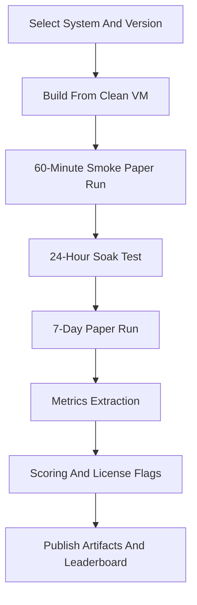

# Trading Bot Inventory And Benchmark Blueprint

Status: research capture  
Captured: March 7, 2026  
Purpose: support an Elastifund competitive page and an internal, reproducible bake-off against leading trading bots and algorithmic trading systems.

Companion doc: `research/non_trading_revenue_agent_research.md`

## Executive Summary

A literal "full inventory of every trading bot on the web" is not enumerable. The defensible operational definition of comprehensive is:

- widely adopted open-source execution bots and frameworks
- widely used commercial systems with official sites, docs, or repos
- platforms that can plausibly be benchmarked under controlled conditions

For Elastifund, that means comparing against end-to-end platforms, not just turnkey grid or DCA bots. Users will expect the comparison set to include execution engines, research frameworks, integrated platforms, SaaS automation products, self-hosted proprietary software, and exchange-native bots.

The main conclusion is straightforward: a public comparison page is only credible if it leads with methodology, discloses what "paper trading" means per system, separates license classes clearly, and avoids profitability claims in favor of operational metrics.

## Why This Matters For Elastifund

This research is directly useful for two parallel goals:

- public positioning on `Elastifund.io`
- internal benchmark design for a multi-system paper-trading lab

The strongest implications are:

- The active OSS execution tier is real and recent enough to benchmark seriously: Freqtrade, Hummingbot, NautilusTrader, CCXT, and vn.py / VeighNa all show credible maintenance signals as of early March 2026.
- Historically popular bots such as Gekko and Zenbot are useful only as legacy references, not as production-grade baseline competitors.
- License class is a first-order commercial concern. GPL, AGPL, LGPL, permissive, and source-available-with-restrictions cannot be collapsed into one "open source" bucket.
- Commercial crypto automation platforms are mostly SaaS workflow products, not apples-to-apples equivalents of OSS backtesting engines. They need a separate comparison surface.

## Scope And Taxonomy

### Inclusion Criteria

A system belongs in the inventory if it satisfies all or most of the following:

- it has a verifiable official repo, site, pricing page, or documentation set
- it has observable practitioner adoption or community usage
- it supports at least one operationally relevant workflow:
  backtesting, paper trading, live trading, portfolio automation, exchange connectivity, or research pipelines

### User-Facing Taxonomy

This is the practical taxonomy users will apply when they land on an Elastifund comparison page:

- `Execution-capable OSS bots/frameworks`
  Run strategies and connect to exchanges or brokers, with paper/live capability at least architecturally.
- `Research/backtesting engines and toolkits`
  Primarily simulation and research systems, sometimes with live adapters.
- `Integrated platform ecosystems`
  Visual tooling, data pipelines, orchestration, or multi-node deployments.
- `Commercial SaaS automation platforms`
  Hosted bot orchestration, signal routing, copy trading, backtests, and exchange-account management.
- `Commercial self-hosted proprietary`
  Paid software the user runs locally or on their own machine.
- `Exchange-native bots`
  Automation that exists as a feature of the exchange, not a standalone product.

## High-Signal Findings

### Maintenance Tiering

As of March 7, 2026, the tier-1 OSS execution set with recent maintenance signals is:

- Freqtrade
- Hummingbot
- NautilusTrader
- CCXT
- vn.py / VeighNa

This matters because maintenance recency should affect benchmark weightings and public claims. A stale but historically popular repo is not equivalent to a currently maintained execution platform.

### Legacy Baselines Are Still Useful

Gekko and Zenbot still matter for historical context because users remember them, but they should be labeled clearly as legacy or unmaintained. They are useful for:

- historical comparisons
- "how far the tooling ecosystem has moved" framing
- explaining why Elastifund is not benchmarking against abandoned repos as production peers

### License Differentiation Is Mandatory

License treatment cannot be a footnote. At minimum, the public comparison should flag:

- permissive: MIT, Apache-2.0
- weak copyleft: LGPL-3.0
- strong copyleft: GPL-3.0
- network copyleft: AGPL-3.0
- source-available with commercial restrictions: Commons Clause or similar

### SaaS Products Need A Different Methodology

Commercial automation platforms often expose:

- templates
- bot limits
- paper environments
- signal routing
- copy-trading or terminal workflows

They usually do not expose the full internal execution loop. A public benchmark must say that clearly and avoid pretending SaaS internal latency is fully observable.

## Catalog

Notes:

- Community metrics below are captured from visible GitHub metadata as of March 7, 2026.
- Exchange and broker coverage is summarized at a high level. It should be revalidated when a live benchmark cycle starts.
- Public pricing reflects high-level list-price signals only.

### Open-Source Execution-Capable Systems

| System | Type | Language | License | Maintenance Signal | Markets | Key Notes | Community | Pricing |
| --- | --- | --- | --- | --- | --- | --- | --- | --- |
| Freqtrade | OSS bot | Python | GPL-3.0 | Release Feb 28, 2026; commits Mar 6, 2026 | Crypto spot | Backtesting, dry-run, plotting, money management, Telegram, web UI, ML optimization | 47.4k stars / 9.9k forks | Free |
| Hummingbot | OSS framework | Python | Apache-2.0 | Release Mar 2, 2026; commits Mar 2, 2026 | Crypto CEX + DEX | Strategy framework, strong connector ecosystem, Docker-first onboarding | 17.6k / 4.5k / 224 contributors | Free |
| NautilusTrader | OSS framework | Rust + Python | LGPL-3.0 | Release Mar 3, 2026; updated Mar 7, 2026 | Multi-asset | Deterministic simulation, research-to-live parity, event-driven architecture | 21k / 2.5k | Free |
| OctoBot | OSS bot/platform | Python | GPL-3.0 | Release Dec 29, 2025; commits Mar 4, 2026 | Crypto | AI, grid, DCA, TradingView workflows, simulation mode, optional cloud ecosystem | 5.4k / 1.1k | Free |
| Jesse | OSS framework | Python | MIT | Commits Feb 14, 2026 | Crypto | Backtesting, optimization, live workflow, self-hosted privacy framing | 7.5k / 1.1k / 48 contributors | Free |
| vn.py / VeighNa | OSS platform | Python | MIT | Release Dec 24, 2025 | Multi-module quant trading | Gateway architecture, institutional-style module ecosystem, broad adoption signals | 37.4k / 11k / 124 contributors | Free |
| Lumibot | OSS library | Python | GPL-3.0 | Release Mar 6, 2026 | Stocks, options, crypto, futures, forex | Same-code backtest-to-live framing, broker/data integrations | 1.3k / 264 / 40 contributors | Free |

### Open-Source Research, Backtesting, And Toolkit Systems

| System | Type | Language | License | Maintenance Signal | Markets | Key Notes | Community | Pricing |
| --- | --- | --- | --- | --- | --- | --- | --- | --- |
| Lean | OSS engine + commercial cloud | C# + Python | Apache-2.0 | Pushed Mar 6, 2026 | Multi-asset | Event-driven engine with Docker-friendly local CLI workflows | 17.6k / 4.5k | Engine free |
| CCXT | OSS toolkit | JS/TS/Python/C#/PHP/Go | MIT | Release Mar 6, 2026; commits Mar 7, 2026 | Crypto | Unified exchange API layer used across trading and data systems | 41.2k / 8.5k / 746 contributors | Free |
| Backtrader | OSS library | Python | GPL-3.0 | Commits Apr 19, 2023 | General | Mature backtesting framework with broad community use | 20.6k / 4.9k | Free |
| zipline-reloaded | OSS library | Python/Cython | Apache-2.0 | Release Jul 23, 2025; commits Nov 13, 2025 | Equities-style | Maintained fork of Quantopian Zipline with CLI and ingest pipeline | 1.7k / 282 | Free |
| Backtesting.py | OSS library | Python | AGPL-3.0 | Commits Dec 20, 2025 | General | Lightweight backtesting API with plotting | 8k / 1.4k / 42 contributors | Free |
| vectorbt | Source-available | Python | Apache-2.0 + Commons Clause | Release Jan 26, 2026; commits Jan 28, 2026 | General | High-performance backtesting and research engine with commercial restrictions | 6.8k / 881 | Free to use, restricted commercially |
| Qlib | OSS research platform | Python | MIT | Release Aug 15, 2025 | Mostly equities research | End-to-end ML research stack from data to backtesting | 38.4k / 6k | Free |
| FinRL | OSS research framework | Python/Jupyter | MIT | Release Jun 26, 2022 | Stocks, crypto, portfolio allocation | RL-focused research environment | 14.1k / 3.2k / 121 contributors | Free |
| Superalgos | OSS platform | JS/Node | Apache-2.0 | Release Nov 2, 2024; commits Oct 1, 2024 | Crypto | Visual workflows, data mining, backtesting, paper/live claims, multi-server positioning | 5.3k / 6.1k / 170 contributors | Free |

### Legacy Open-Source Baselines

| System | Status | Language | License | Maintenance Signal | Notes | Community |
| --- | --- | --- | --- | --- | --- | --- |
| Zenbot | Unmaintained | Node.js | MIT | Release Oct 1, 2018; commits Feb 5, 2022 | Backtesting, paper mode, TA strategies, plugin architecture | 8.3k stars / 2k forks |
| Gekko | Archived / unmaintained | Node.js | MIT | Commits Apr 2019; repo states not maintained | TA bot plus UI and backtesting history | 10.2k / 3.9k |

These should be labeled as `historical baselines`, not `current production peers`.

### Widely Used Commercial Automation Platforms

| System | Delivery Model | Public Paper Surface | Market Focus | Publicly Visible Offer Shape | Public Pricing Signal |
| --- | --- | --- | --- | --- | --- |
| 3Commas | SaaS | Partial / implied via bot tooling | Crypto | Grid bot, DCA bot, SmartTrade, signal bot, backtesting | Starter around $20/mo with discounted pricing seen around $15/mo |
| Cryptohopper | SaaS | Explicit paper bot included per subscription | Crypto | Trading bot, market making, arbitrage variants | $9.99 to $99.99/mo |
| Bitsgap | SaaS | Bot automation surface; paper details not cleanly exposed in captured material | Crypto | Bots, AI assistant, portfolio tracking, smart orders | Starts around $23/mo |
| Coinrule | SaaS | Explicit demo trading on free plan | Crypto | Rule builder, TradingView integration, basket logic, templates | Starts around $29.99/mo |
| WunderTrading | SaaS | Bot limits visible; paper labeling not explicit in captured material | Crypto | Signal, grid, DCA, multi-API trade, Telegram tooling | Free to $89.95/mo |
| Cornix | SaaS | Backtesting tiers visible; paper labeling not explicit in captured material | Crypto | Manual, signal, grid, DCA, TradingView bots | Plans around $32.99 and up |
| HaasOnline | SaaS + enterprise | Explicit paper-trading-first onboarding | Crypto | Strategy templates, HaasScript, automation tooling | $9/mo to $149/mo |
| Gunbot | Self-hosted proprietary | Paper mode not clearly established in captured material | Crypto | Self-hosted app with pre-built strategies and unlimited-pair claims | Lifetime licenses around $199 to $299 |
| Pionex | Exchange-native | Exchange feature set, not an external paper stack | Crypto | Built-in bots monetized through trading fees | Bots free, exchange fee example 0.05% spot |

### Special Note On Shrimpy

The research did not surface an authoritative official pricing page from official `shrimpy.io` material during the capture window. Third-party pricing references should not be treated as authoritative for this catalog.

## Standardized Benchmark Program

### Test Environment Assumptions

- Host OS: Ubuntu 22.04 LTS
- Runtime: Python 3.10 available
- Container runtime: Docker available
- Network: outbound HTTPS allowed, local inbound ports allowed for dashboards
- Secrets: kept out of git; rotated after each test cycle

### Benchmarking Principle

A defensible benchmark needs two layers:

- `generic harness layer`
  Common logging, metrics, failure injection, scoring, and run orchestration.
- `system-specific adapter layer`
  Project-specific install steps, config translation, mode selection, and paper-trading verification.

### Suggested Harness Layout

```text
inventory/
  systems/<system_id>/
  strategies/
  metrics/
  results/<system_id>/<run_id>/
```

### Runtime Contract For Every System

Every benchmarked system should emit or be adapted into the same evidence surface:

- orders ledger:
  `intent -> submitted -> accepted -> filled/canceled`
- market data ledger:
  timestamps plus the quotes or snapshots used at decision time
- health signals:
  heartbeat, reconnect count, error count, queue backlog
- resource usage:
  CPU, RSS memory, disk IO, network

This is essential because "paper trading" varies by platform:

- internal dry-run or simulator
- exchange sandbox or testnet
- broker paper account

The benchmark must disclose which surface was used for each system.

### Preferred Paper-Testing Surface

Priority order for crypto systems:

1. native dry-run or paper mode on live market data
2. exchange testnet where supported and stable
3. live capital testing only in a separate, gated program

Dry-run on live market data is the only approach broad enough to standardize across many systems with minimal bespoke work.

### Per-System Runbooks

These are benchmark checklists, not installation tutorials.

#### Freqtrade

- Prefer Docker to avoid local TA-lib friction.
- Generate a default config and explicitly enable `dry_run`.
- Confirm the exchange is on the supported list for the tested release.
- Run a minimal strategy for 30 minutes in dry-run.
- Verify orders are simulated and not sent to the exchange.
- Only enable web UI or Telegram after the baseline dry-run is green.
- Promote to a 7-day paper run and collect order-ledger artifacts.

#### Hummingbot

- Pull only official code from the official organization and docs.
- Use the Docker-first onboarding path.
- Configure one known strategy template and one venue.
- Verify the exact release version under test.
- Run a 60-minute smoke session.
- Force one container restart and confirm reconnect recovery.
- Run 7 days and store logs, configs, and reconnect metrics.

#### NautilusTrader

- Follow official docs with Docker available.
- Choose one concrete venue adapter for comparability.
- Implement a minimal Python strategy skeleton.
- Run deterministic simulation first.
- Then run a paper configuration against live market data with equivalent execution semantics where possible.
- Track divergence between deterministic simulation and venue-facing paper fills.

#### OctoBot

- Pin the exact tested release tag or version.
- Start in simulation mode.
- Use one exchange connector and one simple strategy mode.
- Run headless unless the UI is explicitly part of the benchmark surface.
- Capture UI screenshots and order-ledger exports if the UI is used.

#### Jesse

- Confirm MIT license positioning and connector reality before testing.
- Validate the environment with included backtests first.
- Use a single exchange route for paper if available.
- Otherwise document that paper execution is simulated using live candles and order-book proxies.
- Run a 24-hour soak before the 7-day benchmark.

#### vn.py / VeighNa

- Follow the official Ubuntu install guidance.
- Install a core module such as CTA and run a no-order simulation session first.
- If `vnpy.alpha` is in scope, keep it to offline training or backtest mode during benchmarking.
- Run 7 days in live-data plus simulated-order mode and capture all events.

#### Lumibot

- Validate a clean backtest first.
- Choose a broker with a real paper account where possible.
- Use the "same code from backtest to live" claim as the parity test surface.
- Run 7 days in broker paper mode and reconcile fills against market mid.

#### Lean

- Use Lean CLI and Dockerized workflows.
- Run a deterministic local backtest as baseline.
- Configure paper or simulated live routing through a brokerage model.
- Capture order-event timing, slippage assumptions, and parity artifacts.

#### Backtrader, zipline-reloaded, Backtesting.py, vectorbt, Qlib, FinRL, Superalgos, CCXT

These systems are not uniformly paper-trading bots in the same sense.

The default policy should be:

- benchmark them as backtest and research systems first
- only promote them to paper-trading tests if live adapters exist and can be configured within a capped engineering budget
- suggested cap: `8 engineering hours per system`

For special cases:

- `CCXT`: benchmark exchange connectivity, request latency, and adapter ergonomics, not full bot behavior
- `Superalgos`: use its own forward-testing or live-execution surface and disclose exactly what is simulated versus real

### Evaluation Metrics

The goal is comparability, defensibility, and reproducibility.

#### Latency

- decision latency:
  time from tick receipt to order intent generation
- submit latency:
  time from intent generation to order ack
- reconnect latency:
  time to restore data feeds after forced disconnect

#### Execution Accuracy

- fill model fidelity:
  paper fill versus reference mid or last price
- order type compliance:
  whether post-only, limit, and stop semantics survive translation
- state reconciliation errors:
  mismatches between internal position state and venue or broker state

#### Backtest-To-Live Divergence

- signal divergence rate:
  percentage of bars or ticks where live signals differ from matched-input backtest signals
- P&L divergence:
  normalized difference attributable to slippage, latency, fill assumptions, and fee models

#### Resource Usage

- CPU
- RSS memory
- disk IO
- network throughput
- peak-to-mean ratio to capture spikiness

#### Reliability

- crash-free uptime over 7 days
- exceptions per hour
- missing-tick percentage
- delayed-tick percentage

### Test Matrix

| Test ID | Name | Measures | Pass Criteria |
| --- | --- | --- | --- |
| T0 | Reproducible build | Install success and dependency stability | Clean build succeeds without manual edits |
| T1 | Smoke paper run | Time to first decision and event-loop sanity | Decisions emitted within 15 minutes |
| T2 | Forced restart | Recovery after process crash | Recovery within 5 minutes with no corrupted state |
| T3 | Data-feed disconnect | Reconnect logic and gap handling | Reconnect within 2 minutes and gap handling logged |
| T4 | 24-hour soak | Memory drift and cumulative errors | Less than 10% RSS drift and no crash |
| T5 | 7-day run | Reliability and operational cost | Crash-free uptime at or above 99% and error budget inside threshold |
| T6 | Backtest parity | Research-to-live divergence | Signal divergence inside defined tolerance |
| T7 | Execution fidelity | Slippage and order semantics | Slippage and semantics inside defined band |

### Scoring Rubric

Public rankings should not collapse into a star-count contest or a marketing-claim contest.

#### Hard Gates

- license incompatibility for commercial reuse should raise a clear flag
- maintenance staleness should cap maintenance scoring when recency is too old
- security red flags should disqualify or quarantine the system

#### Weighted Score

| Dimension | Weight | What It Covers |
| --- | --- | --- |
| Reliability and operations | 25 | 7-day uptime, restart recovery, reconnect behavior |
| Execution fidelity | 20 | Fill realism, order semantics, reconciliation |
| Research and iteration speed | 15 | Backtest speed, reproducibility, data-ingest ergonomics |
| Integration breadth | 15 | Venue quality and adapter extensibility |
| Usability and onboarding | 10 | Docs quality, Docker-first install, time to first paper run |
| Community and maintenance | 10 | Adoption, contributor activity, recency |
| License and legal operability | 5 | Reuse constraints and commercial compatibility |

This scoring design prevents legacy popularity from dominating the result.

## Legal, License, And Security Considerations

### License Risk Patterns

- `GPL-3.0`
  Strong copyleft. Relevant projects include Freqtrade, Backtrader, OctoBot, and Lumibot.
- `AGPL-3.0`
  Network copyleft. Relevant here: Backtesting.py.
- `LGPL-3.0`
  Weaker copyleft with linking conditions. Relevant here: NautilusTrader.
- `MIT / Apache-2.0`
  Most commercially operable for reuse and integration.
- `Commons Clause or similar source-available restrictions`
  Not equivalent to permissive open source. Relevant here: vectorbt.

Public comparison pages should use a visible `license flag` column.

### Venue And Broker Policy Risk

Benchmarking still has operational policy risk:

- rate limits
- jurisdictional restrictions
- prohibited automation endpoints
- broker or exchange testnet instability

The harness should include:

- per-venue rate limiting
- read-only-first data collection where feasible
- explicit disclosure of the paper-trading model used for each system

### Supply-Chain Risk

This is a supply-chain exercise as much as a trading benchmark.

Required lab controls:

- official repos and official release channels only
- per-system container isolation
- read-only filesystems where possible
- central secret management
- outbound allowlists where feasible
- lockfiles or pinned dependencies
- key rotation after each benchmark cycle

## Elastifund.io Page Blueprint

The public page should feel like an audited methodology page with a live leaderboard, not ad copy.

### Recommended Page Structure

#### Hero

- headline:
  `How Elastifund Compares To Leading Trading Bots And Open-Source Frameworks`
- subheadline:
  `A reproducible, paper-trading benchmark across execution reliability, latency, and backtest-to-live divergence.`

#### Methodology Block

Put this near the top.

Required points:

- benchmark environment:
  Ubuntu 22.04, Python 3.10, Docker
- benchmark duration:
  7-day paper runs plus smoke and soak tests
- per-system definition of paper trading
- direct statement that profitability claims are not published

Suggested disclosure:

`We do not publish profitability claims. We publish operational and execution-quality metrics under controlled test conditions.`

#### Leaderboard

Recommended filters:

- asset class
- mode: backtest-only or paper-run
- license type
- deployment model: self-hosted or SaaS

Default columns:

- overall score
- reliability
- execution fidelity
- latency
- resource use
- license flag

Each row should expand to show:

- exact tested version
- config hash
- image digest
- run artifact summary

#### Recommended Visuals

- capability heatmap:
  systems by features such as backtest, paper, live, GUI, optimizer, adapters
- 7-day uptime and error-rate sparklines
- radar charts for reliability, fidelity, integration breadth, usability, maintainability
- setup-friction bar chart for time to first paper run

### Suggested Methodology Diagram



## Recommended Execution Order

The benchmark should be built as a repeatable results factory.

### Phase 1 Candidate Set

Start with:

- Freqtrade
- Hummingbot
- NautilusTrader
- CCXT-based integrations
- vn.py
- Lean
- selected commercial platforms:
  3Commas, Cryptohopper, Bitsgap, Coinrule, WunderTrading, HaasOnline

### Phase 2 Expansion

After the first pass is stable, add:

- legacy systems such as Zenbot and Gekko
- research-only engines as backtest baselines
- more commercial platforms as demand warrants

### Recommended Publication Order

1. publish the `How We Test` methodology page
2. run the first full benchmark cycle
3. publish rankings with artifacts and license flags

That order lowers reputational risk and makes cherry-picking accusations easier to rebut.

## Open Decisions To Lock Before Implementation

- Will crypto paper runs be dry-run-on-live-data only, or must exchange testnet support be used when available?
- Should prediction markets be separated from traditional markets in the leaderboard, or compared on shared operational metrics?
- Will scoring weights be fixed and public, or versioned by quarter?

## Working Conclusion

The competitive comparison will only be credible if it is transparent about three things:

- what systems are in scope and why
- what "paper trading" means per system
- how license, maintenance, and observability differences affect scoring

Elastifund should present itself as evidence-first. The strongest public posture is not "we outperform everyone." It is "we test comparable systems under controlled conditions, publish artifacts, and separate execution quality from marketing claims."
